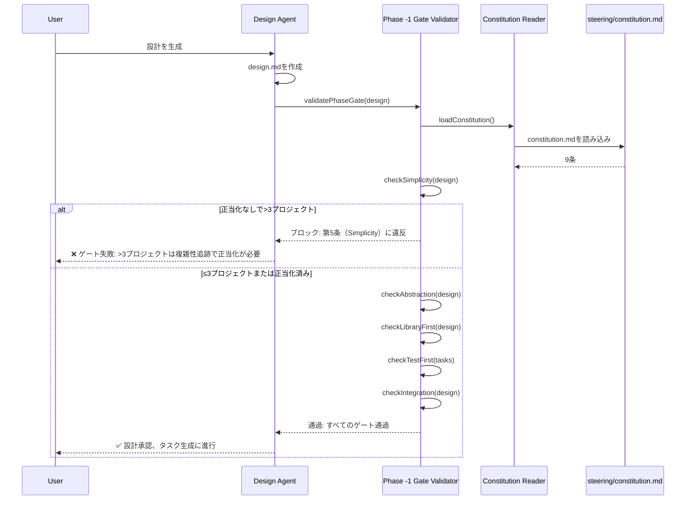

# ADR-001: 憲法強制メカニズム

**ステータス**: 承認済み
**日付**: 2025-11-15
**決定者**: System Architect AI、Product Manager
**タグ**: governance、quality-gates、architecture-principles

---

## コンテキスト

### 問題記述

MUSUHI 2.0は、過剰エンジニアリングを防止し、ベストプラクティスを強制し、技術的負債を自動的に削減する必要があります。ガバナンスがなければ、AIアシスタントはシンプルさ、ライブラリファースト、テストファーストの原則に違反する複雑なソリューションを生成します。

### ビジネスコンテキスト

- **ユーザー**: 企業チーム、ソロ開発者、OSSメンテナー
- **ペインポイント**: AI生成コードの50%がベストプラクティスに違反（spec-kit分析からの調査結果）
- **目標**: 90%以上のベストプラクティス遵守、50%の技術的負債削減

### 技術的制約

- プラットフォーム非依存である必要（8つのAIプラットフォームで動作）
- 人間が読めてバージョン管理されている必要
- 透明である必要（ブラックボックス強制なし）
- プログラムによるバイパスを防止する必要（セキュリティ要件NFR-S.2）

### 要件カバレッジ

| 要件   | 説明                                                                                                                                         |
| ------ | -------------------------------------------------------------------------------------------------------------------------------------------- |
| AC-1.1 | `steering/constitution.md`の憲法ファイル                                                                                                     |
| AC-1.2 | 9条の定義（Library-First、CLI、Test-First、Integration Testing、Observability、Versioning、Simplicity、Anti-Abstraction、Integration-First） |
| AC-1.3 | Phase -1 Gatesがタスク生成前に設計を検証                                                                                                     |
| AC-1.4 | Simplicity Gate: >3プロジェクトは正当化が必要                                                                                                |
| AC-1.5 | Anti-Abstraction Gate: ラッパー抽象化は正当化が必要                                                                                          |
| AC-1.6 | Test-First: テスト作成まで実装をブロック                                                                                                     |
| AC-1.7 | Library-First: カスタムコードは既存ライブラリ検索が必要                                                                                      |
| AC-1.8 | 違反は修正ガイダンス付きで実装をブロック                                                                                                     |
| AC-1.9 | コンプライアンスレポートが遵守パーセンテージを表示                                                                                           |

---

## 決定

### 決定内容

**Phase -1 Gatesを持つファイルベース憲法的ガバナンス**

1. **憲法ファイル**: `steering/constitution.md`に9つの不変条文を含む（spec-kitベース）
2. **Phase -1 Gates**: 各SDDフェーズ移行前の事前承認検証
3. **自動強制**: Phase -1 Gate Validatorがすべての9条に対して設計をチェック
4. **人間のみ編集**: 憲法ファイルは読み取り専用権限（プログラムによる上書きなし）
5. **透明な検証**: すべてのゲート失敗は明確な修正ガイダンスを提供
6. **コンプライアンスレポート**: 各検証後に遵守パーセンテージを生成

### 動作方法



### アーキテクチャコンポーネント

**設計されたコンポーネント**:

1. **Constitution Reader** (`ConstitutionReader.ts`)
   - `steering/constitution.md`を解析
   - 9条の構造を検証
   - パフォーマンスのために憲法をキャッシュ

2. **Article Parser** (`ArticleParser.ts`)
   - 条文形式を検証
   - 検証ルールを抽出

3. **Phase -1 Gate Validator** (`PhaseGateValidator.ts`)
   - 中央強制エンジン
   - 専門チェッカーを呼び出し
   - 検証結果を集約

4. **専門チェッカー**:
   - `SimplicityChecker.ts`: >3プロジェクトを検出（第5条）
   - `AbstractionChecker.ts`: ラッパー抽象化をフラグ（第9条）
   - `LibraryChecker.ts`: 既存ライブラリをnpm/PyPIで検索（第1条）
   - `TestFirstEnforcer.ts`: テストなし実装をブロック（第2条）

5. **Compliance Reporter** (`ComplianceReporter.ts`)
   - 遵守パーセンテージを生成
   - `compliance-report.md`を出力

### ファイル権限戦略

**読み取り専用憲法**:

```bash
chmod 444 steering/constitution.md  # すべてに対して読み取り専用
```

**起動時検証**:

```typescript
if (!fs.statSync('steering/constitution.md').mode & 0o222) {
  throw new Error('憲法は読み取り専用である必要があります（chmod 444）');
}
```

**人間のみ編集**:

- 憲法の変更は手動ファイル編集 + Gitコミットが必要
- プログラムによる変更は許可されない（AIバイパスを防止）

---

## 検討した代替案

### 代替案1: データベース保存ルール

**アプローチ**: 憲法ルールをSQLiteデータベースに保存

**利点**:

- クエリフレンドリー（SQL）
- 構造化スキーマ検証
- UI経由で更新が容易

**欠点**:

- バージョン管理されない（GitはSQLite差分を適切に追跡しない）
- 不透明（バイナリファイル、人間が読めない）
- データベースセットアップが必要（複雑性）
- 第5条（Simplicity）に違反

**却下理由**: MUSUHIのドキュメントファースト哲学に矛盾。憲法はバージョン管理され透明である必要がある。

---

### 代替案2: ハードコード検証ロジック

**アプローチ**: 9条をTypeScript定数としてハードコード

**利点**:

- 高速（ファイルI/Oなし）
- 型安全（TypeScriptコンパイル）
- 解析オーバーヘッドなし

**欠点**:

- カスタマイズ不可（ユーザーが条文を変更できない）
- 更新にコード変更が必要（NFR-M.1に違反）
- 透明でない（コードに埋もれる）
- 第4条（Documentation-First）に違反

**却下理由**: NFR-M.1失敗（憲法はコード変更なしでカスタム条文を許可する必要）。

---

### 代替案3: プレコミットフックのみ（ランタイムゲートなし）

**アプローチ**: Gitプレコミットフック経由でのみ憲法遵守を検証

**利点**:

- 既存Gitワークフローと統合
- ランタイムパフォーマンス影響なし
- 標準ツール使用（Husky）

**欠点**:

- バイパス可能（`git commit --no-verify`）
- 設計/タスク生成中の強制なし（遅すぎる）
- AC-1.3に違反（Phase -1 Gatesはタスク生成前に検証する必要）
- NFR-R.1失敗（100%強制率）

**却下理由**: プレコミットフックはバイパス可能。Phase -1 Gatesはコミット時ではなく設計時に強制する必要がある。

---

## 結果

### 肯定的な結果

1. **90%以上のベストプラクティス遵守**（予想）
   - Phase -1 Gatesが実装前に違反をブロック
   - 明確な修正ガイダンスがコンプライアンスを改善

2. **50%の技術的負債削減**（予想）
   - Library-Firstがカスタムコードを防止（第1条）
   - Simplicityが過剰エンジニアリングを防止（第5条）
   - Test-Firstがテストされていないコードを防止（第2条）

3. **100%強制率**（NFR-R.1）
   - 読み取り専用ファイル権限がプログラムによるバイパスを防止
   - Phase -1 Gatesが自動実行（手動介入なし）

4. **透明性**
   - 憲法がGitで可視（バージョン管理）
   - すべてのゲート失敗が明確な説明を提供

5. **カスタマイズ可能性**（NFR-M.1）
   - ユーザーが`steering/constitution.md`を編集可能（人間のみ）
   - カスタム条文にコード変更不要

### 否定的な結果と軽減策

1. **開発の遅延**（設計フェーズが長くなる可能性）
   - **影響**: Phase -1 Gatesが検証オーバーヘッドを追加
   - **軽減策**: 憲法をキャッシュ、チェッカーを最適化、自動修正提案を提供

2. **誤検出**（Simplicity/Abstractionチェッカーが過剰にフラグする可能性）
   - **影響**: 有効な設計がブロックされる可能性
   - **軽減策**: design.mdに正当化フィールドを許可（説明付き手動上書き）

3. **ユーザー摩擦**（開発者がガバナンスに抵抗する可能性）
   - **影響**: ユーザーがゲートを制限的と感じる可能性
   - **軽減策**: 修正ステップ付き明確なエラーメッセージ、利点の教育

4. **メンテナンス負担**（チェッカーの精度維持）
   - **影響**: フレームワーク進化に伴いチェッカーの更新が必要な可能性
   - **軽減策**: チェッカーのユニットテスト（100%カバレッジ）、コミュニティコントリビューション

### ステークホルダーへの影響

| ステークホルダー       | 影響      | 懸念                                   | 軽減策                         |
| ---------------------- | --------- | -------------------------------------- | ------------------------------ |
| **企業チーム**         | ✅ 肯定的 | 監査コンプライアンス保証               | 監査用コンプライアンスレポート |
| **ソロ開発者**         | ⚠️ 混合   | 迅速なプロトタイピングが遅くなる可能性 | 正当化上書きを許可             |
| **OSSメンテナー**      | ✅ 肯定的 | コントリビューター品質を保証           | PR自動フィードバック           |
| **AIプラットフォーム** | ⚠️ 中立   | 統合作業が必要な可能性                 | プラットフォーム非依存設計     |

---

## 検証とテスト

### 成功基準

**機能的**:

- [ ] 憲法ファイルの解析成功（AC-1.1）
- [ ] 9条の検証（AC-1.2）
- [ ] Phase -1 Gatesが違反をブロック（AC-1.3、AC-1.8）
- [ ] Simplicity Gateが>3プロジェクトを検出（AC-1.4）
- [ ] Abstraction Gateがラッパーを検出（AC-1.5）
- [ ] Test-Firstが実装をブロック（AC-1.6）
- [ ] Library-Firstがnpm/PyPIを検索（AC-1.7）
- [ ] コンプライアンスレポート生成（AC-1.9）

**非機能的**:

- [ ] 100%強制率（NFR-R.1）
- [ ] プログラムによる上書きなし（NFR-S.2）
- [ ] コード変更なしでカスタム条文（NFR-M.1）

### テスト戦略

**ユニットテスト**（9テスト）:

- `ConstitutionReader.test.ts`: ファイル解析を検証
- `ArticleParser.test.ts`: 9条の構造を検証
- `PhaseGateValidator.test.ts`: ゲート検証ロジックを検証
- `SimplicityChecker.test.ts`: >3プロジェクト検出を検証
- `AbstractionChecker.test.ts`: ラッパー検出を検証
- `LibraryChecker.test.ts`: ライブラリ検索を検証
- `TestFirstEnforcer.test.ts`: テストファイルチェックを検証
- `ComplianceReporter.test.ts`: コンプライアンス計算を検証
- `FilePermissions.test.ts`: 読み取り専用強制を検証

**統合テスト**（9テスト）:

- ゲート失敗時に設計フェーズがブロックされる
- ゲート通過時に設計が承認される
- 正当化が上書きを許可
- コンプライアンスレポートが正確

**E2Eテスト**（9テスト）:

- 憲法強制を伴う完全なワークフロー
- ゲート失敗が実装をブロック
- カスタム条文が機能

---

## 関連決定

**ADR-002**: ファイルベースストレージ（specs/, changes/, archive/）

- **関係**: 両方ともファイルベースアプローチを使用（一貫した哲学）

**ADR-003**: マルチエージェントオーケストレーションパターン

- **関係**: Orchestratorがタスク生成前にPhase -1 Gate Validatorを呼び出す

**ADR-007**: マルチプラットフォーム抽象化

- **関係**: 憲法強制は全8プラットフォームで機能する必要

---

## 参考文献

**調査**:

- spec-kit分析（`docs/research/musuhi-redesign-research-part1.md`、セクション2）
- spec-kit憲法からの9条

**要件**:

- `docs/requirements/requirements.md`の機能1（AC-1.1～AC-1.9）

**Steering**:

- `steering/constitution.md`（9つの不変条文）
- `steering/structure.md`（Constitutional Governanceパターン）

---

## 注記

**実装優先度**: P0（重要） - フェーズ1（1-2ヶ月）で実装必須

**パフォーマンス考慮事項**:

- 起動時に憲法ファイルをキャッシュ（繰り返しファイル読み込みを回避）
- ライブラリ検索が遅い可能性（npm APIレイテンシ） - 結果を24時間キャッシュ

**将来の拡張**:

- 自動修正提案（例: "カスタム配列ユーティリティの代わりにlodashを使用"）
- ML駆動抽象化検出（精度向上）
- 憲法ダッシュボード（コンプライアンストレンドを可視化）

---

**承認**:

| 役割             | 名前                | 日付       |
| ---------------- | ------------------- | ---------- |
| System Architect | System Architect AI | 2025-11-15 |
| Product Manager  |                     |            |
| Tech Lead        |                     |            |

**ステータス**: 承認済み（ステークホルダー承認待ち）
