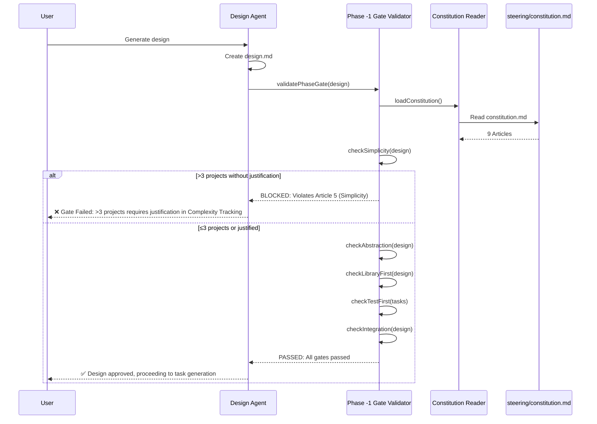

# ADR-001: Constitutional Enforcement Mechanism

**Status**: Accepted
**Date**: 2025-11-15
**Deciders**: System Architect AI, Product Manager
**Tags**: governance, quality-gates, architecture-principles

---

## Context

### Problem Statement

MUSUHI 2.0 must prevent over-engineering, enforce best practices, and reduce technical debt automatically. Without governance, AI assistants generate complex solutions that violate simplicity, library-first, and test-first principles.

### Business Context

- **Users**: Enterprise teams, solo developers, OSS maintainers
- **Pain Point**: 50% of AI-generated code violates best practices (research finding from spec-kit analysis)
- **Goal**: 90%+ best practices adherence, 50% technical debt reduction

### Technical Constraints

- Must be platform-agnostic (work across 8 AI platforms)
- Must be human-readable and version-controlled
- Must be transparent (no black-box enforcement)
- Must prevent programmatic bypass (security requirement NFR-S.2)

### Requirements Coverage

| Requirement | Description                                                                                                                                          |
| ----------- | ---------------------------------------------------------------------------------------------------------------------------------------------------- |
| AC-1.1      | Constitution file at `steering/constitution.md`                                                                                                      |
| AC-1.2      | 9 Articles defined (Library-First, CLI, Test-First, Integration Testing, Observability, Versioning, Simplicity, Anti-Abstraction, Integration-First) |
| AC-1.3      | Phase -1 Gates validate design before task generation                                                                                                |
| AC-1.4      | Simplicity Gate: >3 projects requires justification                                                                                                  |
| AC-1.5      | Anti-Abstraction Gate: wrapper abstractions require justification                                                                                    |
| AC-1.6      | Test-First: implementation blocked until tests created                                                                                               |
| AC-1.7      | Library-First: custom code requires existing library search                                                                                          |
| AC-1.8      | Violations block implementation with remediation guidance                                                                                            |
| AC-1.9      | Compliance report shows adherence percentage                                                                                                         |

---

## Decision

### What We Decided

**File-Based Constitutional Governance with Phase -1 Gates**

1. **Constitution File**: `steering/constitution.md` contains 9 immutable Articles (based on spec-kit)
2. **Phase -1 Gates**: Pre-approval validation before each SDD phase transition
3. **Automated Enforcement**: Phase -1 Gate Validator checks design against all 9 Articles
4. **Human-Only Editing**: Constitution file has read-only permissions (no programmatic override)
5. **Transparent Validation**: All gate failures provide clear remediation guidance
6. **Compliance Reporting**: Generate adherence percentage after each validation

### How It Works



### Architecture Components

**Components Designed**:

1. **Constitution Reader** (`ConstitutionReader.ts`)
   - Parses `steering/constitution.md`
   - Validates 9 Articles structure
   - Caches constitution for performance

2. **Article Parser** (`ArticleParser.ts`)
   - Validates Article format
   - Extracts validation rules

3. **Phase -1 Gate Validator** (`PhaseGateValidator.ts`)
   - Central enforcement engine
   - Calls specialized checkers
   - Aggregates validation results

4. **Specialized Checkers**:
   - `SimplicityChecker.ts`: Detects >3 projects (Article 5)
   - `AbstractionChecker.ts`: Flags wrapper abstractions (Article 9)
   - `LibraryChecker.ts`: Searches npm/PyPI for existing libraries (Article 1)
   - `TestFirstEnforcer.ts`: Blocks implementation without tests (Article 2)

5. **Compliance Reporter** (`ComplianceReporter.ts`)
   - Generates adherence percentage
   - Outputs `compliance-report.md`

### File Permissions Strategy

**Read-Only Constitution**:

```bash
chmod 444 steering/constitution.md  # Read-only for all
```

**Validation at Startup**:

```typescript
if (!fs.statSync('steering/constitution.md').mode & 0o222) {
  throw new Error('Constitution must be read-only (chmod 444)');
}
```

**Human-Only Editing**:

- Constitution changes require manual file edit + Git commit
- No programmatic modification allowed (prevents AI bypass)

---

## Alternatives Considered

### Alternative 1: Database-Stored Rules

**Approach**: Store constitutional rules in SQLite database

**Pros**:

- Query-friendly (SQL)
- Structured schema validation
- Easy to update via UI

**Cons**:

- Not version-controlled (Git doesn't track SQLite diffs well)
- Opaque (binary file, not human-readable)
- Requires database setup (complexity)
- Violates Article 5 (Simplicity)

**Why Rejected**: Contradicts MUSUHI's document-first philosophy. Constitution must be version-controlled and transparent.

---

### Alternative 2: Hardcoded Validation Logic

**Approach**: Hardcode 9 Articles as TypeScript constants

**Pros**:

- Fast (no file I/O)
- Type-safe (TypeScript compilation)
- No parsing overhead

**Cons**:

- Not customizable (users can't modify Articles)
- Requires code changes to update (violates NFR-M.1)
- Not transparent (buried in code)
- Violates Article 4 (Documentation-First)

**Why Rejected**: Fails NFR-M.1 (Constitution must allow custom Articles without code changes).

---

### Alternative 3: Pre-Commit Hooks Only (No Runtime Gates)

**Approach**: Validate constitution compliance only via Git pre-commit hooks

**Pros**:

- Integrates with existing Git workflow
- No runtime performance impact
- Uses standard tooling (Husky)

**Cons**:

- Can be bypassed (`git commit --no-verify`)
- No enforcement during design/task generation (too late)
- Violates AC-1.3 (Phase -1 Gates must validate before task generation)
- Fails NFR-R.1 (100% enforcement rate)

**Why Rejected**: Pre-commit hooks are bypassable. Phase -1 Gates must enforce at design time, not commit time.

---

## Consequences

### Positive Outcomes

1. **90%+ Best Practices Adherence** (Expected)
   - Phase -1 Gates block violations before implementation
   - Clear remediation guidance improves compliance

2. **50% Technical Debt Reduction** (Expected)
   - Library-First prevents custom code (Article 1)
   - Simplicity prevents over-engineering (Article 5)
   - Test-First prevents untested code (Article 2)

3. **100% Enforcement Rate** (NFR-R.1)
   - Read-only file permissions prevent programmatic bypass
   - Phase -1 Gates run automatically (no manual intervention)

4. **Transparency**
   - Constitution visible in Git (version-controlled)
   - All gate failures provide clear explanations

5. **Customizability** (NFR-M.1)
   - Users can edit `steering/constitution.md` (human-only)
   - No code changes required for custom Articles

### Negative Outcomes & Mitigations

1. **Slower Development** (Design phase may take longer)
   - **Impact**: Phase -1 Gates add validation overhead
   - **Mitigation**: Cache constitution, optimize checkers, provide auto-fix suggestions

2. **False Positives** (Simplicity/Abstraction checkers may over-flag)
   - **Impact**: Valid designs may be blocked
   - **Mitigation**: Allow justification field in design.md (manual override with explanation)

3. **User Friction** (Developers may resist governance)
   - **Impact**: Users may find gates restrictive
   - **Mitigation**: Clear error messages with remediation steps, education on benefits

4. **Maintenance Burden** (Keeping checkers accurate)
   - **Impact**: Checkers may need updates as frameworks evolve
   - **Mitigation**: Unit tests for checkers (100% coverage), community contributions

### Impact on Stakeholders

| Stakeholder          | Impact      | Concern                         | Mitigation                    |
| -------------------- | ----------- | ------------------------------- | ----------------------------- |
| **Enterprise Teams** | ✅ Positive | Audit compliance guaranteed     | Compliance reports for audits |
| **Solo Developers**  | ⚠️ Mixed    | May slow down rapid prototyping | Allow justification overrides |
| **OSS Maintainers**  | ✅ Positive | Ensures contributor quality     | Auto-feedback on PRs          |
| **AI Platforms**     | ⚠️ Neutral  | May require integration work    | Platform-agnostic design      |

---

## Validation & Testing

### Success Criteria

**Functional**:

- [ ] Constitution file parsed successfully (AC-1.1)
- [ ] 9 Articles validated (AC-1.2)
- [ ] Phase -1 Gates block violations (AC-1.3, AC-1.8)
- [ ] Simplicity Gate detects >3 projects (AC-1.4)
- [ ] Abstraction Gate detects wrappers (AC-1.5)
- [ ] Test-First blocks implementation (AC-1.6)
- [ ] Library-First searches npm/PyPI (AC-1.7)
- [ ] Compliance report generated (AC-1.9)

**Non-Functional**:

- [ ] 100% enforcement rate (NFR-R.1)
- [ ] No programmatic override (NFR-S.2)
- [ ] Custom Articles without code changes (NFR-M.1)

### Test Strategy

**Unit Tests** (9 tests):

- `ConstitutionReader.test.ts`: Verify file parsing
- `ArticleParser.test.ts`: Verify 9 Articles structure
- `PhaseGateValidator.test.ts`: Verify gate validation logic
- `SimplicityChecker.test.ts`: Verify >3 projects detection
- `AbstractionChecker.test.ts`: Verify wrapper detection
- `LibraryChecker.test.ts`: Verify library search
- `TestFirstEnforcer.test.ts`: Verify test file check
- `ComplianceReporter.test.ts`: Verify compliance calculation
- `FilePermissions.test.ts`: Verify read-only enforcement

**Integration Tests** (9 tests):

- Design phase blocked when gate fails
- Design approved when gate passes
- Justification allows override
- Compliance report accurate

**E2E Tests** (9 tests):

- Complete workflow with constitutional enforcement
- Gate failure blocks implementation
- Custom Articles work

---

## Related Decisions

**ADR-002**: File-Based Storage (specs/, changes/, archive/)

- **Relationship**: Both use file-based approach (consistent philosophy)

**ADR-003**: Multi-Agent Orchestration Patterns

- **Relationship**: Orchestrator calls Phase -1 Gate Validator before task generation

**ADR-007**: Multi-Platform Abstraction

- **Relationship**: Constitution enforcement must work across all 8 platforms

---

## References

**Research**:

- spec-kit analysis (`docs/research/musuhi-redesign-research-part1.md`, Section 2)
- 9 Articles from spec-kit constitution

**Requirements**:

- Feature 1 (AC-1.1 through AC-1.9) in `docs/requirements/requirements.md`

**Steering**:

- `steering/constitution.md` (9 immutable Articles)
- `steering/structure.md` (Constitutional Governance pattern)

---

## Notes

**Implementation Priority**: P0 (Critical) - Must be implemented in Phase 1 (Months 1-2)

**Performance Considerations**:

- Constitution file cached on startup (avoid repeated file reads)
- Library search may be slow (npm API latency) - cache results for 24 hours

**Future Enhancements**:

- Auto-fix suggestions (e.g., "Use lodash instead of custom array utils")
- ML-powered abstraction detection (higher accuracy)
- Constitutional dashboard (visualize compliance trends)

---

**Approval**:

| Role             | Name                | Date       |
| ---------------- | ------------------- | ---------- |
| System Architect | System Architect AI | 2025-11-15 |
| Product Manager  |                     |            |
| Tech Lead        |                     |            |

**Status**: Accepted (awaiting stakeholder approval)
