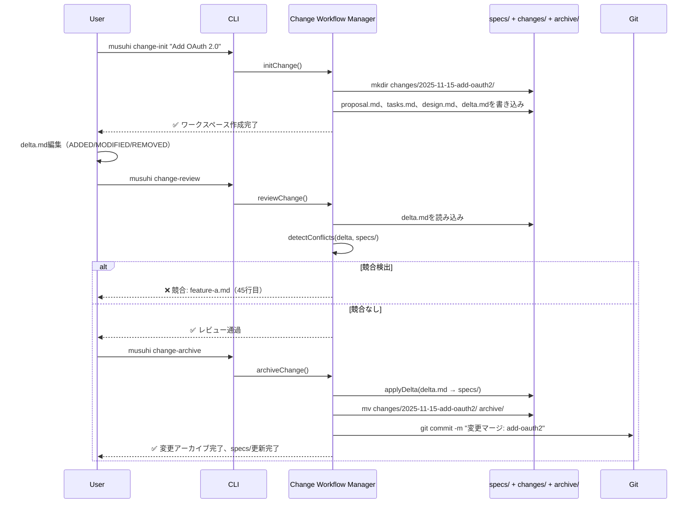

# ADR-002: ファイルベースストレージ vs データベース

**ステータス**: 承認済み
**日付**: 2025-11-15
**決定者**: System Architect AI、Product Manager
**タグ**: storage、change-management、brownfield、architecture-pattern

---

## コンテキスト

### 問題記述

MUSUHI 2.0は、完全な監査証跡を持つ仕様、提案された変更、履歴的決定を管理する必要があります。システムは以下をサポートする必要があります:

- **Brownfieldプロジェクト**: 進化する要件を持つ既存のコードベース
- **変更提案**: 構造化されたdelta形式（ADDED/MODIFIED/REMOVED）
- **監査コンプライアンス**: 企業ユーザー向けの完全な履歴（SOC 2、ISO 27001）
- **バージョン管理**: Git対応ストレージ（人間が読める差分）

### ビジネスコンテキスト

- **ユーザー**: 企業チーム（監査証跡）、OSSメンテナー（コントリビューションワークフロー）、レガシー近代化チーム（brownfield）
- **ペインポイント**: 従来のプロジェクト管理ツールは仕様の構造化変更ワークフローが欠如
- **目標**: 100% brownfieldサポート、完全な監査証跡

### 技術的制約

- Git対応である必要（人間が読める差分、バイナリファイルなし）
- マルチ仕様変更をサポートする必要（単一提案が複数仕様に影響）
- マージ中のデータ損失を防止する必要（NFR-R.2: 100%データ整合性）
- オフラインで動作する必要（クラウド依存なし）

### 要件カバレッジ

| 要件   | 説明                                                                           |
| ------ | ------------------------------------------------------------------------------ |
| AC-2.1 | 2フォルダー構造: specs/（真実）、changes/（提案）、archive/（完了）            |
| AC-2.2 | 変更初期化がproposal.md、tasks.md、design.md、specs/を持つワークスペースを作成 |
| AC-2.3 | Delta形式がADDED、MODIFIED、REMOVEDセクションをサポート                        |
| AC-2.4 | 単一変更が複数仕様ファイルに影響可能                                           |
| AC-2.5 | 変更レビューがdeltaを検証、競合をチェック、レビューレポートを生成              |
| AC-2.6 | 変更アーカイブがdeltaをspecs/にマージ、archive/に移動、タイムスタンプ          |
| AC-2.7 | 競合検出がレビュー失敗し解決ガイダンスを提供                                   |
| AC-2.8 | アーカイブが完全な履歴を保持（提案根拠、タスク、delta）                        |
| AC-2.9 | 変更ステータスが状態（Draft/Review/Approved/Archived）、進捗%、保留承認を表示  |

---

## 決定

### 決定内容

**Delta形式の2フォルダーモデル（ファイルベースストレージ）**

1. **ディレクトリ構造**:

   ```
   project/
   ├── specs/              # 承認された仕様（安定、承認後は読み取り専用）
   │   ├── feature-a.md
   │   └── feature-b.md
   ├── changes/            # 提案された変更（delta形式）
   │   └── 2025-11-15-add-oauth2/
   │       ├── proposal.md       # 変更根拠
   │       ├── delta.md          # ADDED/MODIFIED/REMOVED
   │       ├── tasks.md          # 実装計画
   │       ├── design.md         # 設計詳細
   │       └── specs/            # 影響を受ける仕様ファイル（参照）
   │           ├── feature-a.md  # コピーまたは参照
   │           └── feature-c.md  # 新規仕様
   └── archive/            # 履歴的変更（マージまたは却下）
       └── 2025-11-10-add-2fa/
           ├── proposal.md
           ├── delta.md
           ├── tasks.md
           ├── design.md
           └── merged-at.txt     # タイムスタンプ
   ```

2. **Delta形式**（`delta.md`）:

   ```markdown
   ## ADDED

   - 新機能: OAuth 2.0認証
   - 新要件: AC-9.1（WHENユーザーがログイン、システムSHALL OAuth 2.0をサポート）

   ## MODIFIED

   - [Before] 認証はAPIキーのみ使用

   * [After] 認証はAPIキーANDOAuth 2.0をサポート

   ## REMOVED

   - 廃止: HTTP Basic認証（セキュリティリスク）
   ```

3. **変更ワークフロー**:
   - **初期化**: `musuhi change-init "Add OAuth 2.0"` → `changes/`にワークスペースを作成
   - **編集**: ユーザーが`delta.md`、`proposal.md`、`tasks.md`、`design.md`を編集
   - **レビュー**: `musuhi change-review` → deltaを検証、競合を検出
   - **アーカイブ**: `musuhi change-archive` → `specs/`にマージ、`archive/`に移動

4. **ストレージ技術**:
   - **形式**: Markdown + YAML（人間が読める、Git対応）
   - **パーサー**: `unified` + `remark`（Markdown AST）、`js-yaml`（YAML frontmatter）
   - **バージョン管理**: Git（すべてのspecs/changes/archiveがバージョン管理）

### 動作方法



### アーキテクチャコンポーネント

**設計されたコンポーネント**:

1. **Change Workflow Manager** (`ChangeWorkflowManager.ts`)
   - 変更ライフサイクルの中央調整
   - 専門コンポーネントを呼び出し

2. **Change Initializer** (`ChangeInitializer.ts`)
   - 変更ワークスペースを作成
   - テンプレートファイルを生成

3. **Delta Parser** (`DeltaParser.ts`)
   - delta.md（ADDED/MODIFIED/REMOVED）を解析
   - delta構造を検証

4. **Conflict Detector** (`ConflictDetector.ts`)
   - deltaを現在のspecs/と比較
   - 行レベルの競合を識別
   - 解決ガイダンスを生成

5. **Delta Applier** (`DeltaApplier.ts`)
   - ADDED/MODIFIED/REMOVEDをspecs/にマージ
   - アトミックマージを保証（全部または何もなし）

6. **Archive Manager** (`ArchiveManager.ts`)
   - changes/をarchive/に移動
   - マージをタイムスタンプ
   - 完全な履歴を保持

7. **Change Status Tracker** (`ChangeStatusTracker.ts`)
   - 状態を計算（Draft/Review/Approved/Archived）
   - 進捗パーセンテージを計算

---

## 検討した代替案

### 代替案1: データベースバックドストレージ（PostgreSQL）

**アプローチ**: specs、changes、deltaをPostgreSQLデータベースに保存

**スキーマ**:

```sql
CREATE TABLE specs (
  id UUID PRIMARY KEY,
  name VARCHAR(255),
  content TEXT,  -- Markdownコンテンツ
  version INT,
  created_at TIMESTAMP,
  updated_at TIMESTAMP
);

CREATE TABLE changes (
  id UUID PRIMARY KEY,
  name VARCHAR(255),
  delta JSONB,  -- {added: [], modified: [], removed: []}
  state VARCHAR(50),  -- Draft/Review/Approved/Archived
  created_at TIMESTAMP
);

CREATE TABLE deltas (
  id UUID PRIMARY KEY,
  change_id UUID REFERENCES changes(id),
  spec_id UUID REFERENCES specs(id),
  operation VARCHAR(50),  -- ADDED/MODIFIED/REMOVED
  content TEXT
);
```

**利点**:

- クエリフレンドリー（SQL）
- トランザクション整合性（ACID）
- SQL経由の競合検出
- スケーラブル（100万以上の仕様）

**欠点**:

- Git対応でない（バイナリデータベース、人間が読める差分なし）
- データベースセットアップが必要（複雑性、第5条: Simplicityに違反）
- バージョン管理されない（GitはPostgreSQL差分を追跡しない）
- オフライン不可能（データベースサーバーが必要）
- MUSUHIのドキュメントファースト哲学に違反

**却下理由**: コア原則に矛盾（ドキュメント駆動、データベース駆動でない）。仕様はバージョン管理され人間が読める必要がある。

---

### 代替案2: 変更用のGitブランチ

**アプローチ**: `changes/`ディレクトリの代わりにGitブランチを使用

**ワークフロー**:

```bash
git checkout -b feature/add-oauth2    # 変更ブランチを作成
# specs/feature-a.mdを編集
git commit -m "OAuth 2.0を追加"         # 変更をコミット
git checkout main
git merge feature/add-oauth2          # mainにマージ
git tag archived/add-oauth2           # タグでアーカイブ
```

**利点**:

- ネイティブGitワークフロー（開発者に馴染み深い）
- Gitがマージと競合を処理
- カスタムツール不要
- バージョン管理組み込み

**欠点**:

- 構造化delta形式なし（git diffでADDED/MODIFIED/REMOVEDが不明確）
- ブランチに提案根拠なし（コミットメッセージを使用する必要）
- タスク/設計分離なし（すべてコミット内）
- 変更ステータスのクエリが困難（git logパース必要）
- AC-2.1に違反（specs/、changes/、archive/フォルダーが必要）
- マルチ仕様変更のグループ化なし（仕様ごとに個別コミット）

**却下理由**: AC-2.3（delta形式）とAC-2.4（マルチ仕様変更）失敗。Gitブランチには構造化変更メタデータが欠如。

---

### 代替案3: ハイブリッド（ファイルベース + SQLiteインデックス）

**アプローチ**: specs/changes/archiveをファイルとして保存、クエリ用にSQLiteでインデックス

**構造**:

```
project/
├── specs/
├── changes/
├── archive/
└── .musuhi/
    └── index.db  # SQLiteインデックス（change_id、state、progress%、specs_affected）
```

**利点**:

- Git対応（ファイルがバージョン管理）
- 高速クエリ（SQLiteインデックス）
- 人間が読める（Markdownファイル）
- 両方の良いとこ取り

**欠点**:

- インデックス同期の複雑性（ファイルとデータベースが乖離する可能性）
- SQLiteがバージョン管理されない（バイナリファイル）
- 小規模プロジェクトには過剰エンジニアリング（第5条に違反）
- メンテナンス負担の追加

**却下理由**: 現在のスケールには過剰エンジニアリング。ファイルベースクエリは<1000仕様で十分（NFR-SC.1）。スケールが10K仕様を超えた場合は再検討。

---

## 結果

### 肯定的な結果

1. **100% Brownfieldサポート**
   - 変更ワークフローが反復的要件進化を許可
   - Delta形式が変更を明示的に

2. **完全な監査証跡**（AC-2.8）
   - アーカイブが提案、タスク、設計、delta、タイムスタンプを保持
   - SOC 2、ISO 27001準拠（企業要件）

3. **Git対応**
   - 人間が読める差分（Markdown）
   - すべてのspecs/changes/archiveのバージョン管理
   - GitHub、GitLab、Bitbucketで動作

4. **100%データ整合性**（NFR-R.2）
   - Delta Applierがアトミックマージを使用（全部または何もなし）
   - 競合検出がデータ損失を防止

5. **シンプルさ**（第5条）
   - データベースセットアップ不要
   - オフラインで動作（ローカルファイルのみ）

### 否定的な結果と軽減策

1. **遅いクエリ**（SQL比較）
   - **影響**: 1000以上の変更のリストが遅い可能性
   - **軽減策**: 遅延読み込み、ページネーション、ファイルキャッシング（10K以上の仕様の場合はSQLiteインデックス再検討）

2. **手動競合解決**（Gitマージ競合）
   - **影響**: ユーザーが複雑な競合を手動解決する必要
   - **軽減策**: Conflict Detectorが行レベルガイダンスを提供、自動マージ戦略を提案

3. **トランザクションなし**（データベースACID比較）
   - **影響**: プロセスクラッシュ時に部分的delta適用の可能性
   - **軽減策**: アトミックマージ（一時ファイルに書き込み、リネーム）、コミット前に整合性を検証

4. **マージ競合**（並行変更）
   - **影響**: 2人のユーザーが同時に同じ仕様を編集
   - **軽減策**: Gitマージワークフロー、ロックファイル（musuhi.lock）、警告付き最後書き込み勝利

### ステークホルダーへの影響

| ステークホルダー   | 影響      | 懸念                           | 軽減策                      |
| ------------------ | --------- | ------------------------------ | --------------------------- |
| **企業チーム**     | ✅ 肯定的 | 完全な監査証跡                 | アーカイブが履歴を保持      |
| **OSSメンテナー**  | ✅ 肯定的 | Git対応ワークフロー            | ネイティブGit統合           |
| **ソロ開発者**     | ✅ 肯定的 | シンプルさ（データベースなし） | オフラインで動作            |
| **レガシーチーム** | ✅ 肯定的 | Brownfieldサポート             | 段階的変更のためのdelta形式 |

---

## 検証とテスト

### 成功基準

**機能的**:

- [ ] 2フォルダー構造作成（AC-2.1）
- [ ] 変更初期化が動作（AC-2.2）
- [ ] Delta形式解析（AC-2.3）
- [ ] マルチ仕様変更追跡（AC-2.4）
- [ ] 変更レビューが競合検出（AC-2.5、AC-2.7）
- [ ] 変更アーカイブが正しくマージ（AC-2.6）
- [ ] アーカイブが履歴保持（AC-2.8）
- [ ] 変更ステータスが正確（AC-2.9）

**非機能的**:

- [ ] 100%データ整合性（NFR-R.2）
- [ ] Git対応（人間が読める差分）
- [ ] オフライン動作（クラウド依存なし）

### テスト戦略

**ユニットテスト**（9テスト）:

- `ChangeInitializer.test.ts`: ワークスペース作成を検証
- `DeltaParser.test.ts`: ADDED/MODIFIED/REMOVED解析を検証
- `ConflictDetector.test.ts`: 競合検出アルゴリズムを検証
- `DeltaApplier.test.ts`: マージロジックを検証
- `ArchiveManager.test.ts`: アーカイブプロセスを検証
- `ChangeStatusTracker.test.ts`: 状態計算を検証
- `MultiSpecChange.test.ts`: マルチ仕様追跡を検証
- `AtomicMerge.test.ts`: 全部または何もなしマージを検証
- `GitIntegration.test.ts`: アーカイブ後のGitコミットを検証

**統合テスト**（9テスト）:

- 完全な変更ライフサイクル（init → edit → review → archive）
- 競合検出がマージを防止
- マルチ仕様変更が複数ファイルに影響
- アーカイブが履歴を保持

**E2Eテスト**（9テスト）:

- 完全なbrownfieldワークフロー
- 並行変更（マージ競合解決）
- 変更ステータス遷移

---

## 関連決定

**ADR-001**: 憲法強制

- **関係**: 両方ともファイルベースアプローチを使用（一貫した哲学）

**ADR-005**: ギャップ分析戦略

- **関係**: ギャップ分析がchanges/を使用してbrownfieldギャップを検出

**ADR-007**: マルチプラットフォーム抽象化

- **関係**: 変更ワークフローは全8プラットフォームで機能する必要

---

## 参考文献

**調査**:

- OpenSpec分析（`docs/research/musuhi-redesign-research-part2.md`、セクション5）
- OpenSpecからの2フォルダーモデル

**要件**:

- `docs/requirements/requirements.md`の機能2（AC-2.1～AC-2.9）

**Steering**:

- `steering/structure.md`（Change Workflowパターン）

---

## 注記

**実装優先度**: P0（重要） - フェーズ1（1-2ヶ月）で実装必須

**パフォーマンス考慮事項**:

- 大規模仕様（>10K行）の競合検出が遅い可能性 - diff アルゴリズム最適化を使用
- Delta適用はアトミックであるべき（一時ファイルに書き込み、リネーム）

**将来の拡張**:

- 競合しない変更の自動マージ（3方向マージアルゴリズム）
- 変更依存グラフ（変更関係を可視化）
- ロールバックコマンド（アーカイブされた変更を元に戻す）
- 変更テンプレート（OAuth 2.0、RBACなど）

---

**承認**:

| 役割             | 名前                | 日付       |
| ---------------- | ------------------- | ---------- |
| System Architect | System Architect AI | 2025-11-15 |
| Product Manager  |                     |            |
| Tech Lead        |                     |            |

**ステータス**: 承認済み（ステークホルダー承認待ち）
