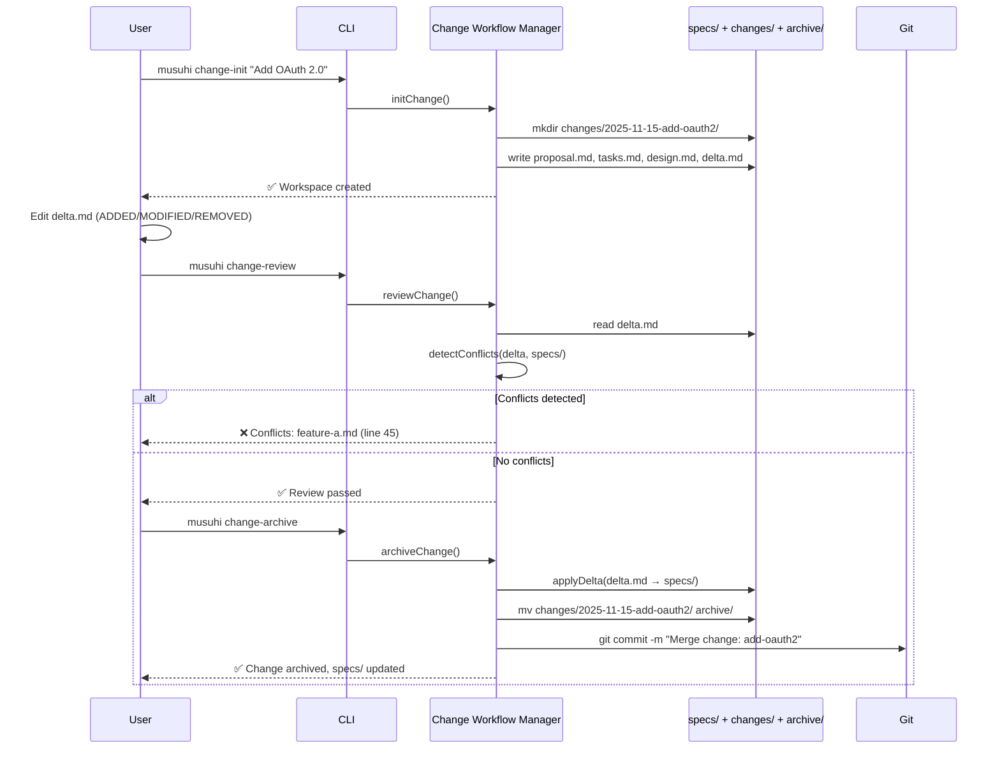

# ADR-002: File-Based Storage vs. Database

**Status**: Accepted
**Date**: 2025-11-15
**Deciders**: System Architect AI, Product Manager
**Tags**: storage, change-management, brownfield, architecture-pattern

---

## Context

### Problem Statement

MUSUHI 2.0 must manage specifications, proposed changes, and historical decisions with full audit trail. The system must support:

- **Brownfield projects**: Existing codebases with evolving requirements
- **Change proposals**: Structured delta format (ADDED/MODIFIED/REMOVED)
- **Audit compliance**: Complete history for enterprise users (SOC 2, ISO 27001)
- **Version control**: Git-friendly storage (human-readable diffs)

### Business Context

- **Users**: Enterprise teams (audit trail), OSS maintainers (contribution workflow), legacy modernization teams (brownfield)
- **Pain Point**: Traditional project management tools lack structured change workflow for specifications
- **Goal**: 100% brownfield support, complete audit trail

### Technical Constraints

- Must be Git-friendly (human-readable diffs, no binary files)
- Must support multi-spec changes (single proposal affects multiple specs)
- Must prevent data loss during merge (NFR-R.2: 100% data integrity)
- Must work offline (no cloud dependencies)

### Requirements Coverage

| Requirement | Description                                                                                 |
| ----------- | ------------------------------------------------------------------------------------------- |
| AC-2.1      | Two-folder structure: specs/ (truth), changes/ (proposals), archive/ (completed)            |
| AC-2.2      | Change initialization creates workspace with proposal.md, tasks.md, design.md, specs/       |
| AC-2.3      | Delta format supports ADDED, MODIFIED, REMOVED sections                                     |
| AC-2.4      | Single change can affect multiple spec files                                                |
| AC-2.5      | Change review validates delta, checks conflicts, generates review report                    |
| AC-2.6      | Change archival merges deltas to specs/, moves to archive/, timestamps                      |
| AC-2.7      | Conflict detection fails review and provides resolution guidance                            |
| AC-2.8      | Archive preserves complete history (proposal rationale, tasks, deltas)                      |
| AC-2.9      | Change status displays state (Draft/Review/Approved/Archived), progress%, pending approvals |

---

## Decision

### What We Decided

**Two-Folder Model with Delta Format (File-Based Storage)**

1. **Directory Structure**:

   ```
   project/
   ├── specs/              # Approved specifications (stable, read-only after approval)
   │   ├── feature-a.md
   │   └── feature-b.md
   ├── changes/            # Proposed changes (delta format)
   │   └── 2025-11-15-add-oauth2/
   │       ├── proposal.md       # Change rationale
   │       ├── delta.md          # ADDED/MODIFIED/REMOVED
   │       ├── tasks.md          # Implementation plan
   │       ├── design.md         # Design details
   │       └── specs/            # Affected spec files (references)
   │           ├── feature-a.md  # Copy or reference
   │           └── feature-c.md  # New spec
   └── archive/            # Historical changes (merged or rejected)
       └── 2025-11-10-add-2fa/
           ├── proposal.md
           ├── delta.md
           ├── tasks.md
           ├── design.md
           └── merged-at.txt     # Timestamp
   ```

2. **Delta Format** (`delta.md`):

   ```markdown
   ## ADDED

   - New feature: OAuth 2.0 authentication
   - New requirement: AC-9.1 (WHEN user logs in, system SHALL support OAuth 2.0)

   ## MODIFIED

   - [Before] Authentication uses API keys only

   * [After] Authentication supports API keys AND OAuth 2.0

   ## REMOVED

   - Deprecated: HTTP Basic Authentication (security risk)
   ```

3. **Change Workflow**:
   - **Initialize**: `musuhi change-init "Add OAuth 2.0"` → Creates workspace in `changes/`
   - **Edit**: User edits `delta.md`, `proposal.md`, `tasks.md`, `design.md`
   - **Review**: `musuhi change-review` → Validates delta, detects conflicts
   - **Archive**: `musuhi change-archive` → Merges to `specs/`, moves to `archive/`

4. **Storage Technology**:
   - **Format**: Markdown + YAML (human-readable, Git-friendly)
   - **Parser**: `unified` + `remark` (Markdown AST), `js-yaml` (YAML frontmatter)
   - **Version Control**: Git (all specs/changes/archive versioned)

### How It Works



### Architecture Components

**Components Designed**:

1. **Change Workflow Manager** (`ChangeWorkflowManager.ts`)
   - Central coordination for change lifecycle
   - Calls specialized components

2. **Change Initializer** (`ChangeInitializer.ts`)
   - Creates change workspace
   - Generates template files

3. **Delta Parser** (`DeltaParser.ts`)
   - Parses delta.md (ADDED/MODIFIED/REMOVED)
   - Validates delta structure

4. **Conflict Detector** (`ConflictDetector.ts`)
   - Compares delta with current specs/
   - Identifies line-level conflicts
   - Generates resolution guidance

5. **Delta Applier** (`DeltaApplier.ts`)
   - Merges ADDED/MODIFIED/REMOVED to specs/
   - Ensures atomic merge (all-or-nothing)

6. **Archive Manager** (`ArchiveManager.ts`)
   - Moves changes/ to archive/
   - Timestamps merge
   - Preserves complete history

7. **Change Status Tracker** (`ChangeStatusTracker.ts`)
   - Calculates state (Draft/Review/Approved/Archived)
   - Computes progress percentage

---

## Alternatives Considered

### Alternative 1: Database-Backed Storage (PostgreSQL)

**Approach**: Store specs, changes, deltas in PostgreSQL database

**Schema**:

```sql
CREATE TABLE specs (
  id UUID PRIMARY KEY,
  name VARCHAR(255),
  content TEXT,  -- Markdown content
  version INT,
  created_at TIMESTAMP,
  updated_at TIMESTAMP
);

CREATE TABLE changes (
  id UUID PRIMARY KEY,
  name VARCHAR(255),
  delta JSONB,  -- {added: [], modified: [], removed: []}
  state VARCHAR(50),  -- Draft/Review/Approved/Archived
  created_at TIMESTAMP
);

CREATE TABLE deltas (
  id UUID PRIMARY KEY,
  change_id UUID REFERENCES changes(id),
  spec_id UUID REFERENCES specs(id),
  operation VARCHAR(50),  -- ADDED/MODIFIED/REMOVED
  content TEXT
);
```

**Pros**:

- Query-friendly (SQL)
- Transactional integrity (ACID)
- Conflict detection via SQL queries
- Scalable (1M+ specs)

**Cons**:

- Not Git-friendly (binary database, no human-readable diffs)
- Requires database setup (complexity, violates Article 5: Simplicity)
- Not version-controlled (Git doesn't track PostgreSQL diffs)
- Offline impossible (requires database server)
- Violates MUSUHI's document-first philosophy

**Why Rejected**: Contradicts core principle (document-driven, not database-driven). Specs must be version-controlled and human-readable.

---

### Alternative 2: Git Branches for Changes

**Approach**: Use Git branches instead of `changes/` directory

**Workflow**:

```bash
git checkout -b feature/add-oauth2    # Create change branch
# Edit specs/feature-a.md
git commit -m "Add OAuth 2.0"         # Commit changes
git checkout main
git merge feature/add-oauth2          # Merge to main
git tag archived/add-oauth2           # Archive with tag
```

**Pros**:

- Native Git workflow (familiar to developers)
- Git handles merges and conflicts
- No custom tooling needed
- Version control built-in

**Cons**:

- No structured delta format (ADDED/MODIFIED/REMOVED unclear in git diff)
- No proposal rationale in branch (must use commit messages)
- No task/design separation (everything in commits)
- Hard to query change status (need git log parsing)
- Violates AC-2.1 (requires specs/, changes/, archive/ folders)
- No multi-spec change grouping (separate commits per spec)

**Why Rejected**: Fails AC-2.3 (delta format) and AC-2.4 (multi-spec changes). Git branches lack structured change metadata.

---

### Alternative 3: Hybrid (File-Based + SQLite Index)

**Approach**: Store specs/changes/archive as files, index in SQLite for queries

**Structure**:

```
project/
├── specs/
├── changes/
├── archive/
└── .musuhi/
    └── index.db  # SQLite index (change_id, state, progress%, specs_affected)
```

**Pros**:

- Git-friendly (files versioned)
- Fast queries (SQLite index)
- Human-readable (Markdown files)
- Best of both worlds

**Cons**:

- Index sync complexity (files vs. database may diverge)
- SQLite not version-controlled (binary file)
- Over-engineering for small projects (violates Article 5)
- Added maintenance burden

**Why Rejected**: Over-engineered for current scale. File-based queries are sufficient for <1000 specs (NFR-SC.1). Reconsider if scale exceeds 10K specs.

---

## Consequences

### Positive Outcomes

1. **100% Brownfield Support**
   - Change workflow allows iterative requirement evolution
   - Delta format makes changes explicit

2. **Complete Audit Trail** (AC-2.8)
   - Archive preserves proposal, tasks, design, delta, timestamp
   - Complies with SOC 2, ISO 27001 (enterprise requirement)

3. **Git-Friendly**
   - Human-readable diffs (Markdown)
   - Version control for all specs/changes/archive
   - Works with GitHub, GitLab, Bitbucket

4. **100% Data Integrity** (NFR-R.2)
   - Delta Applier uses atomic merge (all-or-nothing)
   - Conflict detection prevents data loss

5. **Simplicity** (Article 5)
   - No database setup required
   - Works offline (local files only)

### Negative Outcomes & Mitigations

1. **Slower Queries** (vs. SQL)
   - **Impact**: Listing 1000+ changes may be slow
   - **Mitigation**: Lazy loading, pagination, file caching (reconsider SQLite index if >10K specs)

2. **Manual Conflict Resolution** (Git merge conflicts)
   - **Impact**: Users must manually resolve complex conflicts
   - **Mitigation**: Conflict Detector provides line-level guidance, suggest auto-merge strategies

3. **No Transactions** (vs. database ACID)
   - **Impact**: Partial delta application possible if process crashes
   - **Mitigation**: Atomic merge (write to temp, rename), validate integrity before commit

4. **Merge Conflicts** (Concurrent changes)
   - **Impact**: Two users editing same spec simultaneously
   - **Mitigation**: Git merge workflow, lock files (musuhi.lock), last-write-wins with warning

### Impact on Stakeholders

| Stakeholder          | Impact      | Concern                  | Mitigation                           |
| -------------------- | ----------- | ------------------------ | ------------------------------------ |
| **Enterprise Teams** | ✅ Positive | Complete audit trail     | Archive preserves history            |
| **OSS Maintainers**  | ✅ Positive | Git-friendly workflow    | Native Git integration               |
| **Solo Developers**  | ✅ Positive | Simplicity (no database) | Works offline                        |
| **Legacy Teams**     | ✅ Positive | Brownfield support       | Delta format for incremental changes |

---

## Validation & Testing

### Success Criteria

**Functional**:

- [ ] Two-folder structure created (AC-2.1)
- [ ] Change initialization works (AC-2.2)
- [ ] Delta format parsed (AC-2.3)
- [ ] Multi-spec changes tracked (AC-2.4)
- [ ] Change review detects conflicts (AC-2.5, AC-2.7)
- [ ] Change archival merges correctly (AC-2.6)
- [ ] Archive preserves history (AC-2.8)
- [ ] Change status accurate (AC-2.9)

**Non-Functional**:

- [ ] 100% data integrity (NFR-R.2)
- [ ] Git-friendly (human-readable diffs)
- [ ] Works offline (no cloud dependencies)

### Test Strategy

**Unit Tests** (9 tests):

- `ChangeInitializer.test.ts`: Verify workspace creation
- `DeltaParser.test.ts`: Verify ADDED/MODIFIED/REMOVED parsing
- `ConflictDetector.test.ts`: Verify conflict detection algorithm
- `DeltaApplier.test.ts`: Verify merge logic
- `ArchiveManager.test.ts`: Verify archival process
- `ChangeStatusTracker.test.ts`: Verify state calculation
- `MultiSpecChange.test.ts`: Verify multi-spec tracking
- `AtomicMerge.test.ts`: Verify all-or-nothing merge
- `GitIntegration.test.ts`: Verify Git commit after archive

**Integration Tests** (9 tests):

- Full change lifecycle (init → edit → review → archive)
- Conflict detection prevents merge
- Multi-spec change affects multiple files
- Archive preserves history

**E2E Tests** (9 tests):

- Complete brownfield workflow
- Concurrent changes (merge conflict resolution)
- Change status transitions

---

## Related Decisions

**ADR-001**: Constitutional Enforcement

- **Relationship**: Both use file-based approach (consistent philosophy)

**ADR-005**: Gap Analysis Strategy

- **Relationship**: Gap analysis uses changes/ to detect brownfield gaps

**ADR-007**: Multi-Platform Abstraction

- **Relationship**: Change workflow must work across all 8 platforms

---

## References

**Research**:

- OpenSpec analysis (`docs/research/musuhi-redesign-research-part2.md`, Section 5)
- Two-folder model from OpenSpec

**Requirements**:

- Feature 2 (AC-2.1 through AC-2.9) in `docs/requirements/requirements.md`

**Steering**:

- `steering/structure.md` (Change Workflow pattern)

---

## Notes

**Implementation Priority**: P0 (Critical) - Must be implemented in Phase 1 (Months 1-2)

**Performance Considerations**:

- Conflict detection may be slow for large specs (>10K lines) - use diff algorithm optimization
- Delta application should be atomic (write to temp file, rename)

**Future Enhancements**:

- Auto-merge non-conflicting changes (3-way merge algorithm)
- Change dependency graph (visualize change relationships)
- Rollback command (undo archived change)
- Change templates (OAuth 2.0, RBAC, etc.)

---

**Approval**:

| Role             | Name                | Date       |
| ---------------- | ------------------- | ---------- |
| System Architect | System Architect AI | 2025-11-15 |
| Product Manager  |                     |            |
| Tech Lead        |                     |            |

**Status**: Accepted (awaiting stakeholder approval)
