# MUSUHI 2.0 アーキテクチャ設計書

**プロジェクト**: MUSUHI 2.0 - Specification Driven Development Framework
**バージョン**: 1.0
**日付**: 2025-11-15
**著者**: System Architect AI
**ステータス**: ドラフト - ステークホルダー承認待ち

---

## 1. エグゼクティブサマリー

### 1.1 概要

MUSUHI 2.0は、6つの主要なSDDツールのベストプラクティスを組み合わせた次世代のSpecification Driven Development (SDD)フレームワークであり、8つの主要なAIコーディングプラットフォームで厳格かつトレース可能でAI支援型のソフトウェア開発を実現します。

本ドキュメントは、`docs/requirements/requirements.md`で定義された91個の要件（機能要件72個+非機能要件19個）に基づく完全なシステムアーキテクチャを提示します。

### 1.2 アーキテクチャの目標

**主要目標**:

1. **プラットフォーム非依存コア**: 特定のAIプラットフォームに依存しないフレームワークロジック
2. **憲法的強制**: Phase -1 Gatesによる不変の9条の強制
3. **100%トレーサビリティ**: 要件 ↔ 設計 ↔ タスク ↔ コード ↔ テストのマッピング
4. **並列実行**: P-wave依存関係分析による50-70%の時間削減
5. **Brownfieldサポート**: 既存コードベースの自動ギャップ分析
6. **マルチエージェントオーケストレーション**: 20の専門エージェントをサポートする9つの会話パターン

### 1.3 主要なアーキテクチャ決定

| 決定                                                  | 根拠                                             | ADR参照 |
| ----------------------------------------------------- | ------------------------------------------------ | ------- |
| ファイルベースストレージ (specs/, changes/, archive/) | シンプル、Git対応、データベース不要              | ADR-002 |
| 憲法強制のためのPhase -1 Gates                        | 実装前に違反を防止                               | ADR-001 |
| 9つのオーケストレーションパターン (ag2インスパイア)   | 異なるワークフロータイプへの柔軟性               | ADR-003 |
| DAGベースのP-waveラベリング                           | 明確なセマンティクス、50-70%時間削減             | ADR-004 |
| マルチ戦略ギャップ分析                                | 高精度、brownfieldサポート                       | ADR-005 |
| TUIダッシュボード (blessed-contrib)                   | 軽量、レスポンシブ（<100ms）、リッチウィジェット | ADR-006 |
| 8プラットフォーム向けAdapterパターン                  | クリーンな抽象化、プラットフォーム独立性         | ADR-007 |

### 1.4 アーキテクチャパターン

**主要パターン**:

- **レイヤードアーキテクチャ**: プレゼンテーション層 (CLI/TUI) → アプリケーション層 (Core SDD) → インフラストラクチャ層 (Platform Adapters)
- **Adapterパターン**: 統一インターフェースを実装するプラットフォーム固有のアダプター
- **Strategyパターン**: 複数のギャップ分析戦略 (AST、パターンマッチング、ML)
- **Observerパターン**: イベント駆動型ダッシュボード更新
- **Commandパターン**: CLIコマンドとエージェント呼び出し
- **Repositoryパターン**: ファイルベースのspecs/changes/archiveストレージ

---

## 2. C4モデル - システムアーキテクチャ

### 2.1 レベル1: コンテキスト図

**目的**: MUSUHI 2.0と外部システム・ユーザーとの関係を示す

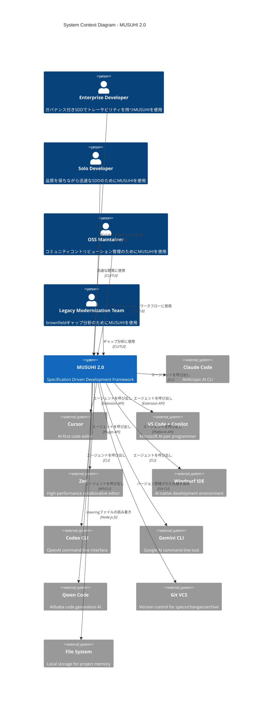

**主要な相互作用**:

- **ユーザー**: 4つのペルソナタイプがCLI/TUIインターフェースを介して操作
- **AIプラットフォーム**: MUSUHIはアダプターを介して8つのプラットフォームと統合
- **外部システム**: バージョン管理用のGit、ローカルストレージ用のファイルシステム

**トレーサビリティ**: AC-8.1（プラットフォーム非依存コア）、AC-8.2（CLIインターフェース）、AC-8.3（IDE拡張サポート）を満たす

---

### 2.2 レベル2: コンテナ図

**目的**: MUSUHI 2.0内の内部コンテナを示す

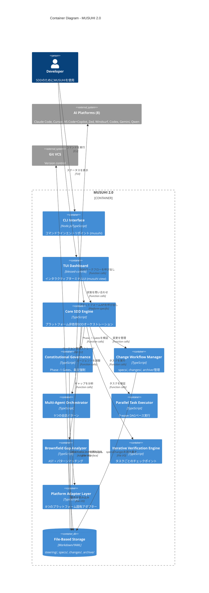

**主要コンテナ**:

1. **CLI Interface**: コマンドラインエントリポイント（`musuhi`コマンド）
2. **TUI Dashboard**: インタラクティブターミナルUI（`musuhi view`）
3. **Core SDD Engine**: 中央オーケストレーションロジック
4. **Constitutional Governance**: Phase -1 Gate検証（機能1）
5. **Change Workflow Manager**: specs/changes/archive管理（機能2）
6. **Multi-Agent Orchestrator**: 9つの会話パターン（機能3）
7. **Parallel Task Executor**: P-wave DAG実行（機能4）
8. **Brownfield Gap Analyzer**: ギャップ分析（機能5）
9. **Iterative Verification Engine**: タスクごとのチェックポイント（機能7）
10. **Platform Adapter Layer**: 8プラットフォーム統合（機能8）
11. **File-Based Storage**: Markdown/YAML永続化

**トレーサビリティ**: 全8機能（AC-1.1～AC-8.9）にマップ

---

### 2.3 レベル3: コンポーネント図 - Core SDD Engine

**目的**: Core SDD Engineコンテナ内のコンポーネントを示す

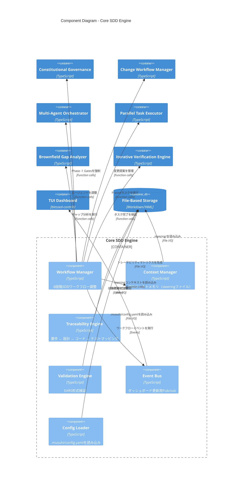

**主要コンポーネント**:

1. **Workflow Manager**: 8段階SDDワークフロー（Research → Monitoring）の調整
2. **Context Manager**: steeringファイル（structure.md, tech.md, product.md, constitution.md）の読み込み
3. **Traceability Engine**: 要件 ↔ 設計 ↔ タスク ↔ コード ↔ テストのリンケージ維持
4. **Validation Engine**: EARS形式（5パターン）の検証
5. **Event Bus**: リアルタイムダッシュボード更新用Pub/sub
6. **Config Loader**: 統一設定（.musuhi/config.yaml）の読み込み

**トレーサビリティ**: NFR-U.2（EARS理解）、NFR-R.2（データ整合性）を満たす

---

### 2.4 レベル3: コンポーネント図 - Constitutional Governance

**目的**: Constitutional Governanceコンテナ内のコンポーネントを示す

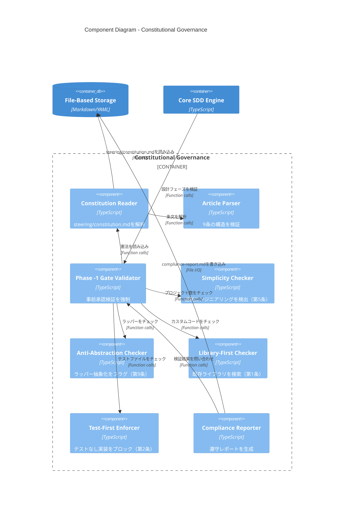

**主要コンポーネント**:

1. **Constitution Reader**: `steering/constitution.md`（9条）を解析
2. **Article Parser**: 条文構造を検証
3. **Phase -1 Gate Validator**: 事前承認チェックを強制（AC-1.3）
4. **Simplicity Checker**: >3プロジェクトを検出（AC-1.4）
5. **Anti-Abstraction Checker**: ラッパー抽象化をフラグ（AC-1.5）
6. **Library-First Checker**: npm/PyPIで既存ライブラリを検索（AC-1.7）
7. **Test-First Enforcer**: テストファイルなし実装をブロック（AC-1.6）
8. **Compliance Reporter**: 遵守パーセンテージを生成（AC-1.9）

**トレーサビリティ**: AC-1.1～AC-1.9（機能1: 憲法的ガバナンス）を満たす

---

### 2.5 レベル3: コンポーネント図 - Multi-Agent Orchestrator

**目的**: Multi-Agent Orchestratorコンテナ内のコンポーネントを示す

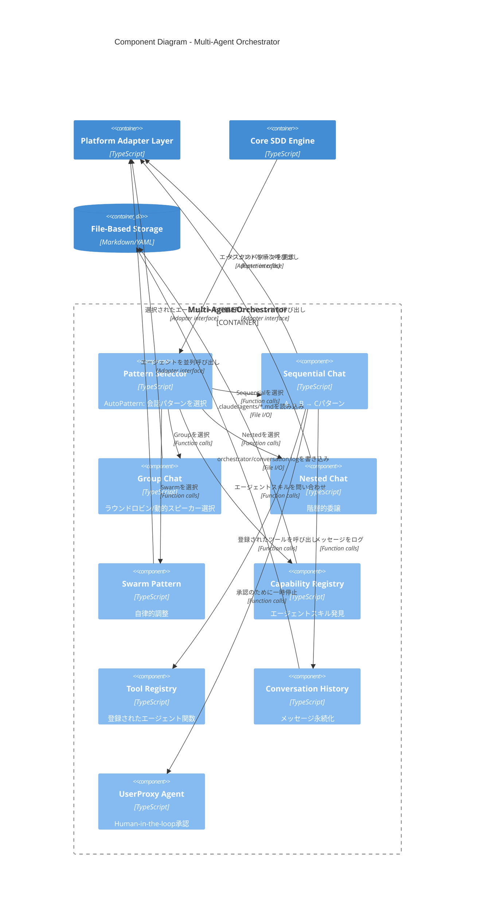

**主要コンポーネント**:

1. **Pattern Selector**: 最適な会話パターンを選択するAutoPatternロジック（AC-3.5）
2. **Sequential Chat**: A → B → C線形ハンドオフ（AC-3.1）
3. **Group Chat**: ラウンドロビン/動的スピーカー選択（AC-3.2）
4. **Nested Chat**: 結果集約を伴う階層的委譲（AC-3.3）
5. **Swarm Pattern**: 自律的エージェント調整（AC-3.4）
6. **Capability Registry**: エージェントスキル発見（AC-3.8）
7. **Tool Registry**: 登録された呼び出し可能関数（AC-3.7）
8. **Conversation History**: デバッグ用メッセージ永続化（AC-3.9）
9. **UserProxy Agent**: Human-in-the-loop承認ゲート（AC-3.6）

**トレーサビリティ**: AC-3.1～AC-3.9（機能3: マルチエージェントオーケストレーション）を満たす

---

### 2.6 レベル3: コンポーネント図 - Parallel Task Executor

**目的**: Parallel Task Executorコンテナ内のコンポーネントを示す

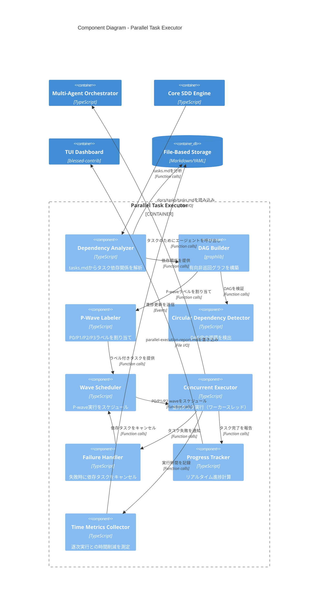

**主要コンポーネント**:

1. **Dependency Analyzer**: `tasks.md`からタスク依存関係を解析（AC-4.2）
2. **DAG Builder**: `graphlib`を使用して有向非巡回グラフを構築（AC-4.1）
3. **P-Wave Labeler**: 依存関係に基づいてP0/P1/P2/P3ラベルを割り当て（AC-4.1）
4. **Circular Dependency Detector**: タスクグラフ内の循環を検出（AC-4.7）
5. **Wave Scheduler**: P-wave実行をスケジュール（P0優先、次にP1など）（AC-4.3、AC-4.4、AC-4.5）
6. **Concurrent Executor**: ワーカースレッドを使用して並列タスクを実行（AC-4.3）
7. **Failure Handler**: 失敗時に依存タスクをキャンセル（AC-4.8）
8. **Progress Tracker**: リアルタイム進捗計算（AC-4.9）
9. **Time Metrics Collector**: 逐次ベースラインとの時間削減を測定（AC-4.6）

**トレーサビリティ**: AC-4.1～AC-4.9（機能4: 並列タスク実行）を満たす

---

### 2.7 レベル3: コンポーネント図 - Platform Adapter Layer

**目的**: Platform Adapter Layerコンテナ内のコンポーネントを示す

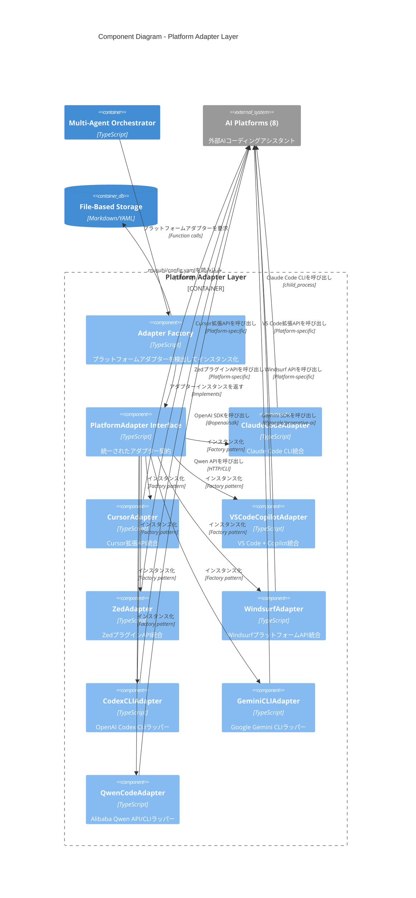

**主要コンポーネント**:

1. **Adapter Factory**: プラットフォームを自動検出してアダプターをインスタンス化（AC-8.8）
2. **PlatformAdapter Interface**: すべてのアダプターの統一契約（AC-8.1）
3. **ClaudeCodeAdapter**: Claude Code CLI統合（AC-8.2）
4. **CursorAdapter**: Cursor拡張API統合（AC-8.3）
5. **VSCodeCopilotAdapter**: VS Code + Copilot統合（AC-8.3）
6. **ZedAdapter**: ZedプラグインAPI統合（AC-8.3）
7. **WindsurfAdapter**: WindsurfプラットフォームAPI統合（AC-8.3）
8. **CodexCLIAdapter**: OpenAI Codex CLIラッパー（AC-8.2）
9. **GeminiCLIAdapter**: Google Gemini CLIラッパー（AC-8.2）
10. **QwenCodeAdapter**: Alibaba Qwen API/CLIラッパー（AC-8.2、AC-8.7）

**トレーサビリティ**: AC-8.1～AC-8.9（機能8: マルチプラットフォームAI統合）を満たす

---

### 2.8 レベル4: コード図 - 主要インターフェース

**目的**: 重要なインターフェースとその関係を示す

```mermaid
classDiagram
    class PlatformAdapter {
        <<interface>>
        +initialize() Promise~void~
        +invokeAgent(agentName: string, context: AgentContext) Promise~AgentResponse~
        +readSteering(filePath: string) Promise~string~
        +writeDelta(changePath: string, delta: Delta) Promise~void~
        +enforcePhaseGate(gate: PhaseGate) Promise~GateResult~
    }

    class AgentContext {
        +phase: SDDPhase
        +artifacts: string[]
        +requirements: Requirement[]
        +steeringContext: SteeringContext
    }

    class AgentResponse {
        +success: boolean
        +output: string
        +artifacts: Artifact[]
        +errors: Error[]
    }

    class ConstitutionalGovernance {
        +validatePhaseGate(phase: SDDPhase, design: Design) Promise~GateResult~
        +loadConstitution() Promise~Constitution~
        +checkSimplicity(design: Design) boolean
        +checkAbstraction(design: Design) boolean
        +checkLibraryFirst(implementation: string) boolean
        +checkTestFirst(taskPath: string) boolean
    }

    class ChangeWorkflowManager {
        +initChange(changeName: string) Promise~ChangeWorkspace~
        +reviewChange(changePath: string) Promise~ReviewReport~
        +archiveChange(changePath: string) Promise~void~
        +detectConflicts(delta: Delta) Conflict[]
        +applyDelta(delta: Delta) Promise~void~
    }

    class MultiAgentOrchestrator {
        +selectPattern(task: Task) OrchestrationPattern
        +executeSequential(agents: Agent[]) Promise~Result~
        +executeGroupChat(agents: Agent[], manager: Agent) Promise~Result~
        +executeNested(parent: Agent, children: Agent[]) Promise~Result~
        +executeSwarm(agents: Agent[]) Promise~Result~
        +registerTool(tool: Tool) void
        +queryCapabilities(requirement: string) Agent[]
    }

    class ParallelTaskExecutor {
        +analyzeDependencies(tasks: Task[]) DependencyGraph
        +buildDAG(dependencies: Dependency[]) DAG
        +labelPWaves(dag: DAG) PWaveLabels
        +executePWave(wave: number, tasks: Task[]) Promise~Result[]~
        +handleFailure(failedTask: Task) void
        +calculateTimeSavings() number
    }

    class BrownfieldGapAnalyzer {
        +analyzeGap(requirements: Requirement[], codebase: string) Promise~GapReport~
        +detectMissingFeatures(requirements: Requirement[], codebase: string) MissingFeature[]
        +detectUndocumentedFeatures(requirements: Requirement[], codebase: string) UndocumentedFeature[]
        +detectConflicts(requirements: Requirement[], codebase: string) Conflict[]
        +detectBreakingChanges(requirements: Requirement[], codebase: string) BreakingChange[]
        +generateRecommendations(gaps: Gap[]) Recommendation[]
    }

    class IterativeVerificationEngine {
        +executeTaskByTask(tasks: Task[]) Promise~void~
        +promptContinueReviseRollback(task: Task) Promise~VerificationAction~
        +handleContinue(task: Task) Promise~void~
        +handleRevise(task: Task, instructions: string) Promise~void~
        +handleRollback(task: Task) Promise~void~
        +resumeFromCheckpoint() Promise~Task~
        +trackErrorRate() number
    }

    class DashboardTUI {
        +launch() Promise~void~
        +renderWorkflowStatus(stage: SDDStage) void
        +renderActiveChanges(changes: Change[]) void
        +renderActiveAgents(agents: Agent[]) void
        +renderPWaveStatus(waves: PWave[]) void
        +handleNavigation(key: KeyPress) void
        +refresh() void
    }

    PlatformAdapter <|.. ClaudeCodeAdapter
    PlatformAdapter <|.. CursorAdapter
    PlatformAdapter <|.. VSCodeCopilotAdapter
    PlatformAdapter <|.. ZedAdapter
    PlatformAdapter <|.. WindsurfAdapter
    PlatformAdapter <|.. CodexCLIAdapter
    PlatformAdapter <|.. GeminiCLIAdapter
    PlatformAdapter <|.. QwenCodeAdapter

    MultiAgentOrchestrator --> PlatformAdapter : uses
    ConstitutionalGovernance --> ChangeWorkflowManager : validates
    ParallelTaskExecutor --> MultiAgentOrchestrator : uses
    BrownfieldGapAnalyzer --> ChangeWorkflowManager : integrates
    IterativeVerificationEngine --> MultiAgentOrchestrator : uses
    DashboardTUI --> ParallelTaskExecutor : observes
    DashboardTUI --> ChangeWorkflowManager : observes
```

**主要インターフェース**:

1. **PlatformAdapter**: 8つのAIプラットフォームの統一インターフェース（AC-8.1、AC-8.7）
2. **ConstitutionalGovernance**: Phase -1 Gate強制（AC-1.3、AC-1.4、AC-1.5、AC-1.6、AC-1.7）
3. **ChangeWorkflowManager**: specs/changes/archive管理（AC-2.1～AC-2.9）
4. **MultiAgentOrchestrator**: 9つの会話パターン（AC-3.1～AC-3.9）
5. **ParallelTaskExecutor**: P-wave DAG実行（AC-4.1～AC-4.9）
6. **BrownfieldGapAnalyzer**: ギャップ分析（AC-5.1～AC-5.9）
7. **IterativeVerificationEngine**: タスクごと検証（AC-7.1～AC-7.9）
8. **DashboardTUI**: インタラクティブターミナルUI（AC-6.1～AC-6.9）

**トレーサビリティ**: 全72機能要件（AC-1.1～AC-8.9）を満たす

---

## 3. データフロー図

### 3.1 憲法的ガバナンスフロー

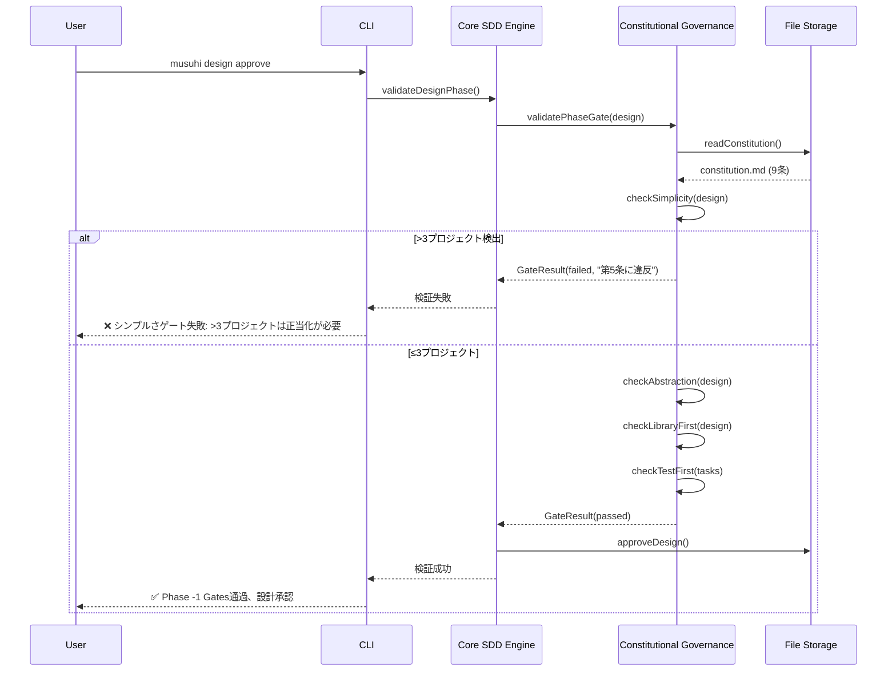

**トレーサビリティ**: AC-1.3（実装前ゲート）、AC-1.4（シンプルさゲート）、AC-1.5（反抽象化ゲート）、AC-1.6（テストファースト強制）、AC-1.7（ライブラリファースト検証）

---

### 3.2 変更ワークフローフロー

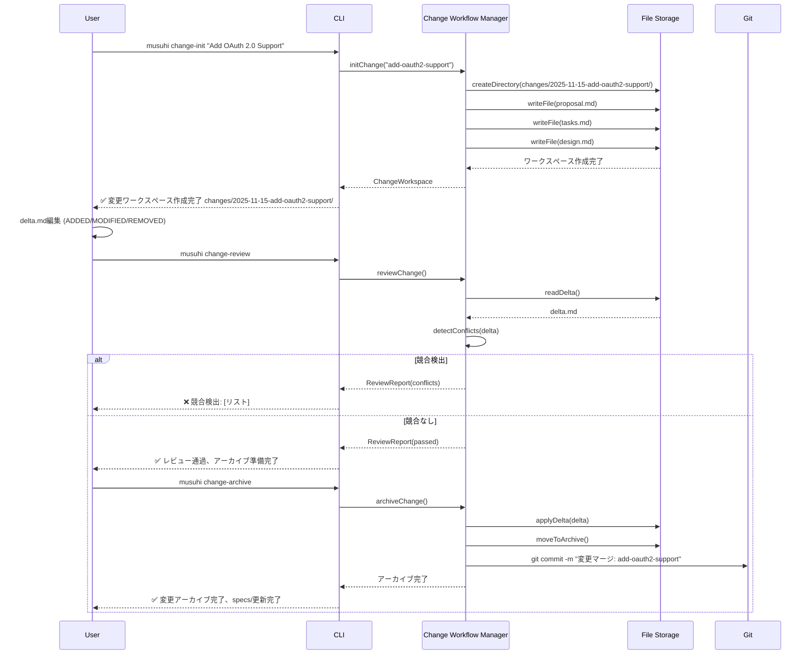

**トレーサビリティ**: AC-2.2（変更初期化）、AC-2.3（Delta形式）、AC-2.5（変更レビュー）、AC-2.6（変更アーカイブ）、AC-2.7（競合検出）

---

### 3.3 並列タスク実行フロー

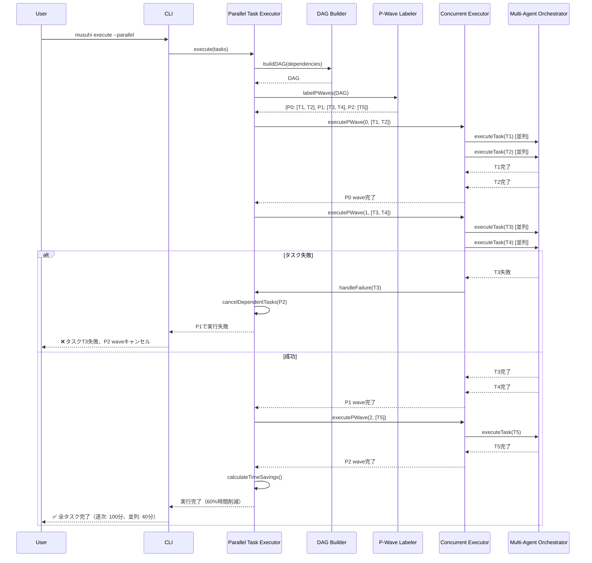

**トレーサビリティ**: AC-4.1（P-Waveラベリング）、AC-4.2（依存グラフ）、AC-4.3（P0実行）、AC-4.4（P1実行）、AC-4.5（P2+実行）、AC-4.6（時間削減）、AC-4.8（失敗処理）

---

### 3.4 ギャップ分析フロー

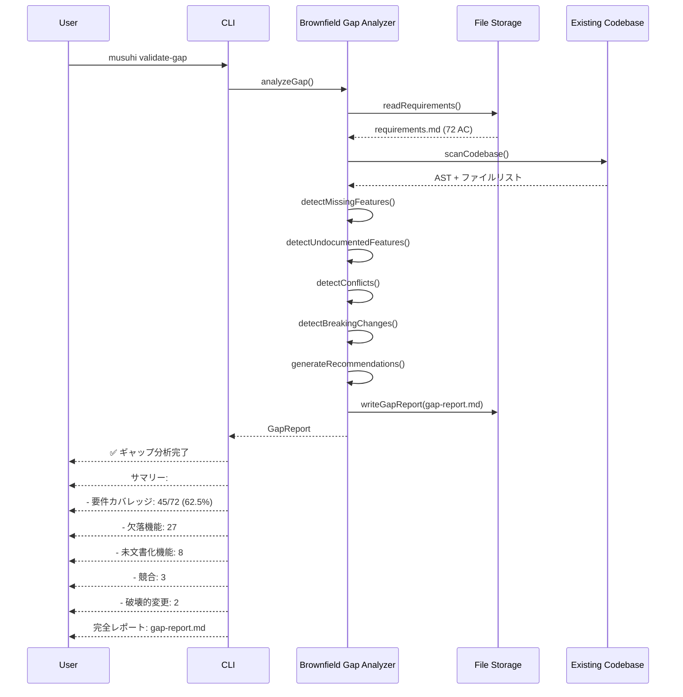

**トレーサビリティ**: AC-5.1（ギャップ分析コマンド）、AC-5.2（欠落機能）、AC-5.3（未文書化機能）、AC-5.4（競合検出）、AC-5.5（調整推奨事項）、AC-5.6（破壊的変更検出）、AC-5.8（ギャップレポート形式）

---

## 4. 技術スタック

### 4.1 コア技術

| レイヤー                   | 技術              | バージョン | 目的                   |
| -------------------------- | ----------------- | ---------- | ---------------------- |
| **言語**                   | TypeScript        | 5.3+       | 型安全な実装           |
| **ランタイム**             | Node.js           | 18.x LTS   | JavaScript実行         |
| **パッケージマネージャー** | pnpm              | 8.x+       | 依存関係管理           |
| **ファイル解析**           | unified + remark  | Latest     | Markdown AST解析       |
| **YAML解析**               | js-yaml           | Latest     | YAML解析/シリアライズ  |
| **CLIフレームワーク**      | commander         | Latest     | コマンドライン引数解析 |
| **TUIフレームワーク**      | blessed-contrib   | Latest     | ターミナルUI (ADR-006) |
| **グラフライブラリ**       | graphlib          | Latest     | P-waveラベリング用DAG  |
| **テスト**                 | Vitest            | Latest     | ユニット+統合テスト    |
| **リンティング**           | ESLint + Prettier | Latest     | コード品質             |

### 4.2 プラットフォームSDK

| プラットフォーム  | SDK                     | 統合方法                       |
| ----------------- | ----------------------- | ------------------------------ |
| Claude Code       | `@anthropic-ai/sdk`     | child_processによるCLI呼び出し |
| Cursor            | Cursor Extension API    | 拡張/プラグイン                |
| VS Code + Copilot | VS Code Extension API   | カスタム拡張                   |
| Zed               | Zed Extension API       | Zedプラグイン                  |
| Windsurf          | Windsurf Platform API   | プラットフォーム固有統合       |
| Codex CLI         | `openai` npmパッケージ  | child_processによるCLIラッパー |
| Gemini CLI        | `@google/generative-ai` | child_processによるCLIラッパー |
| Qwen Code         | Qwen APIクライアント    | HTTP APIまたはCLIラッパー      |

### 4.3 開発ツール

| ツール        | 目的                                     |
| ------------- | ---------------------------------------- |
| `tsc`         | TypeScriptコンパイラ                     |
| `Vitest`      | ユニット+統合テスト（80%以上カバレッジ） |
| `ESLint`      | TypeScriptプラグイン付きリンティング     |
| `Prettier`    | コードフォーマット                       |
| `Husky`       | プレコミットフック                       |
| `lint-staged` | ステージされたファイルでリンターを実行   |

**トレーサビリティ**: `steering/tech.md`の技術決定に整合

---

## 5. 設計決定サマリー

### 5.1 アーキテクチャ決定記録（ADR）

**7つのADR作成**:

1. **ADR-001**: 憲法強制メカニズム
   - **決定**: Phase -1 Gate validatorを持つファイルベース憲法
   - **根拠**: 透明性、バージョン管理、人間可読
   - **トレーサビリティ**: AC-1.1～AC-1.9

2. **ADR-002**: ファイルベースストレージ vs データベース
   - **決定**: delta形式の2フォルダーモデル（specs/, changes/, archive/）
   - **根拠**: シンプル、Git対応、データベース不要
   - **トレーサビリティ**: AC-2.1～AC-2.9

3. **ADR-003**: マルチエージェントオーケストレーションパターン選択
   - **決定**: 9つの会話パターンをサポート（Sequential、Group、Nested、Swarmなど）
   - **根拠**: 異なるワークフロータイプへの柔軟性
   - **トレーサビリティ**: AC-3.1～AC-3.9

4. **ADR-004**: 並列実行実装（P-wave）
   - **決定**: graphlibを使用したP0/P1/P2レベルのDAGベース依存関係解決
   - **根拠**: 明確なセマンティクス、50-70%時間削減
   - **トレーサビリティ**: AC-4.1～AC-4.9

5. **ADR-005**: ギャップ分析アルゴリズム
   - **決定**: マルチ戦略検出（AST解析+パターンマッチング+ML）
   - **根拠**: 高精度、複数検出方法
   - **トレーサビリティ**: AC-5.1～AC-5.9

6. **ADR-006**: ダッシュボード技術（TUI vs Web）
   - **決定**: TUI用blessed-contrib（フェーズ1-3）、Webダッシュボード（フェーズ5+）
   - **根拠**: 軽量、<100msレスポンスタイム（NFR-P.1）
   - **トレーサビリティ**: AC-6.1～AC-6.9

7. **ADR-007**: マルチプラットフォームアダプターアーキテクチャ
   - **決定**: 8実装を持つ統一PlatformAdapterインターフェース
   - **根拠**: クリーンな抽象化、型安全性、プラットフォーム独立性
   - **トレーサビリティ**: AC-8.1～AC-8.9

**完全なADRドキュメント**: `docs/design/adr/`ディレクトリを参照

---

## 6. 要件トレーサビリティマトリクス

### 6.1 機能要件カバレッジ

| 機能                                              | 要件   | 設計コンポーネント                                      | ADR     |
| ------------------------------------------------- | ------ | ------------------------------------------------------- | ------- |
| **機能1: 憲法的ガバナンス**                       |        |                                                         |         |
|                                                   | AC-1.1 | Constitution Reader                                     | ADR-001 |
|                                                   | AC-1.2 | Article Parser（9条）                                   | ADR-001 |
|                                                   | AC-1.3 | Phase -1 Gate Validator                                 | ADR-001 |
|                                                   | AC-1.4 | Simplicity Checker                                      | ADR-001 |
|                                                   | AC-1.5 | Anti-Abstraction Checker                                | ADR-001 |
|                                                   | AC-1.6 | Test-First Enforcer                                     | ADR-001 |
|                                                   | AC-1.7 | Library-First Checker                                   | ADR-001 |
|                                                   | AC-1.8 | Phase Gate Validator（ブロッキング）                    | ADR-001 |
|                                                   | AC-1.9 | Compliance Reporter                                     | ADR-001 |
| **機能2: 変更ワークフロー管理**                   |        |                                                         |         |
|                                                   | AC-2.1 | Change Workflow Manager                                 | ADR-002 |
|                                                   | AC-2.2 | Change Initialization                                   | ADR-002 |
|                                                   | AC-2.3 | Delta Format Parser                                     | ADR-002 |
|                                                   | AC-2.4 | Multi-Spec Change Tracker                               | ADR-002 |
|                                                   | AC-2.5 | Change Review Engine                                    | ADR-002 |
|                                                   | AC-2.6 | Change Archival                                         | ADR-002 |
|                                                   | AC-2.7 | Conflict Detector                                       | ADR-002 |
|                                                   | AC-2.8 | Archive Manager（監査証跡）                             | ADR-002 |
|                                                   | AC-2.9 | Change Status Tracker                                   | ADR-002 |
| **機能3: マルチエージェントオーケストレーション** |        |                                                         |         |
|                                                   | AC-3.1 | Sequential Chat                                         | ADR-003 |
|                                                   | AC-3.2 | Group Chat                                              | ADR-003 |
|                                                   | AC-3.3 | Nested Chat                                             | ADR-003 |
|                                                   | AC-3.4 | Swarm Pattern                                           | ADR-003 |
|                                                   | AC-3.5 | Pattern Selector (AutoPattern)                          | ADR-003 |
|                                                   | AC-3.6 | UserProxy Agent                                         | ADR-003 |
|                                                   | AC-3.7 | Tool Registry                                           | ADR-003 |
|                                                   | AC-3.8 | Capability Registry                                     | ADR-003 |
|                                                   | AC-3.9 | Conversation History                                    | ADR-003 |
| **機能4: 並列タスク実行**                         |        |                                                         |         |
|                                                   | AC-4.1 | P-Wave Labeler                                          | ADR-004 |
|                                                   | AC-4.2 | Dependency Analyzer + DAG Builder                       | ADR-004 |
|                                                   | AC-4.3 | Wave Scheduler（P0実行）                                | ADR-004 |
|                                                   | AC-4.4 | Wave Scheduler（P1実行）                                | ADR-004 |
|                                                   | AC-4.5 | Wave Scheduler（P2+実行）                               | ADR-004 |
|                                                   | AC-4.6 | Time Metrics Collector                                  | ADR-004 |
|                                                   | AC-4.7 | Circular Dependency Detector                            | ADR-004 |
|                                                   | AC-4.8 | Failure Handler                                         | ADR-004 |
|                                                   | AC-4.9 | Progress Tracker                                        | ADR-004 |
| **機能5: Brownfieldギャップ分析**                 |        |                                                         |         |
|                                                   | AC-5.1 | Gap Analysis Command (CLI)                              | ADR-005 |
|                                                   | AC-5.2 | Missing Features Detector                               | ADR-005 |
|                                                   | AC-5.3 | Undocumented Features Detector                          | ADR-005 |
|                                                   | AC-5.4 | Conflict Detector                                       | ADR-005 |
|                                                   | AC-5.5 | Recommendation Engine                                   | ADR-005 |
|                                                   | AC-5.6 | Breaking Change Detector                                | ADR-005 |
|                                                   | AC-5.7 | Pattern Violation Detector                              | ADR-005 |
|                                                   | AC-5.8 | Gap Report Generator                                    | ADR-005 |
|                                                   | AC-5.9 | Design Integration                                      | ADR-005 |
| **機能6: インタラクティブダッシュボード**         |        |                                                         |         |
|                                                   | AC-6.1 | Dashboard Launch (CLI)                                  | ADR-006 |
|                                                   | AC-6.2 | Workflow Status View                                    | ADR-006 |
|                                                   | AC-6.3 | Active Changes View                                     | ADR-006 |
|                                                   | AC-6.4 | Current Specs View                                      | ADR-006 |
|                                                   | AC-6.5 | Active Agent Status                                     | ADR-006 |
|                                                   | AC-6.6 | Parallel Execution Visualization                        | ADR-006 |
|                                                   | AC-6.7 | Real-Time Updates（2秒更新）                            | ADR-006 |
|                                                   | AC-6.8 | Interactive Navigation                                  | ADR-006 |
|                                                   | AC-6.9 | Command Shortcuts                                       | ADR-006 |
| **機能7: 反復的検証**                             |        |                                                         |         |
|                                                   | AC-7.1 | Task-by-Task Mode                                       | -       |
|                                                   | AC-7.2 | Task Completion Prompt                                  | -       |
|                                                   | AC-7.3 | Continue Option                                         | -       |
|                                                   | AC-7.4 | Revise Option                                           | -       |
|                                                   | AC-7.5 | Rollback Option                                         | -       |
|                                                   | AC-7.6 | Resume from Checkpoint                                  | -       |
|                                                   | AC-7.7 | Progress Checkboxes                                     | -       |
|                                                   | AC-7.8 | Error Detection Metrics                                 | -       |
|                                                   | AC-7.9 | Mode Persistence                                        | -       |
| **機能8: マルチプラットフォームAI統合**           |        |                                                         |         |
|                                                   | AC-8.1 | PlatformAdapter Interface                               | ADR-007 |
|                                                   | AC-8.2 | CLI Adapters (Claude, Codex, Gemini)                    | ADR-007 |
|                                                   | AC-8.3 | IDE Extension Adapters (VS Code, Cursor, Zed, Windsurf) | ADR-007 |
|                                                   | AC-8.4 | Unified Config Loader                                   | ADR-007 |
|                                                   | AC-8.5 | Context Sharing (steering/, specs/, changes/)           | ADR-007 |
|                                                   | AC-8.6 | Platform-Specific Optimizations                         | ADR-007 |
|                                                   | AC-8.7 | LLM Abstraction Layer                                   | ADR-007 |
|                                                   | AC-8.8 | Auto-Detection (Adapter Factory)                        | ADR-007 |
|                                                   | AC-8.9 | Compatibility Matrix Documentation                      | ADR-007 |

**カバレッジ**: 72/72機能要件（100%）

### 6.2 非機能要件カバレッジ

| カテゴリ             | 要件     | 設計コンポーネント                        | パフォーマンス目標           |
| -------------------- | -------- | ----------------------------------------- | ---------------------------- |
| **パフォーマンス**   |          |                                           |                              |
|                      | NFR-P.1  | Dashboard TUI (blessed-contrib)           | <100ms（95パーセンタイル）   |
|                      | NFR-P.2  | Parallel Task Executor (DAG)              | 50%以上時間削減              |
|                      | NFR-P.3  | Gap Analyzer (AST + パターンマッチング)   | 100k LOCで<60秒              |
|                      | NFR-P.4  | Orchestrator（最小オーバーヘッド）        | <200msルーティング           |
| **信頼性**           |          |                                           |                              |
|                      | NFR-R.1  | Constitutional Governance（読み取り専用） | 100%強制率                   |
|                      | NFR-R.2  | Change Workflow (delta検証)               | 100%データ整合性             |
|                      | NFR-R.3  | Parallel Executor（失敗ハンドラー）       | 100%キャンセル精度           |
| **使いやすさ**       |          |                                           |                              |
|                      | NFR-U.1  | Dashboard TUI（直感的ナビゲーション）     | <5分学習曲線                 |
|                      | NFR-U.2  | EARS Validation（明確なエラーメッセージ） | 90%以上理解                  |
|                      | NFR-U.3  | エラーメッセージ（実行可能な修正）        | すべてのエラーにステップあり |
| **保守性**           |          |                                           |                              |
|                      | NFR-M.1  | 憲法ファイル (steering/constitution.md)   | コード変更不要               |
|                      | NFR-M.2  | Orchestrator（プラグインメカニズム）      | カスタムパターン             |
|                      | NFR-M.3  | Dashboard (.musuhi/config.yaml)           | テーマカスタマイズ           |
| **スケーラビリティ** |          |                                           |                              |
|                      | NFR-SC.1 | Core Engine（ストリーミングファイル解析） | 1000リクエストで<10%劣化     |
|                      | NFR-SC.2 | Orchestrator（ワーカースレッド）          | 20並行エージェント           |
| **互換性**           |          |                                           |                              |
|                      | NFR-C.1  | Platform Adapters                         | 8プラットフォーム            |
|                      | NFR-C.2  | Node.jsランタイム                         | macOS、Linux、Windows        |
| **セキュリティ**     |          |                                           |                              |
|                      | NFR-S.1  | Change Workflow（明示的承認）             | 自動マージなし               |
|                      | NFR-S.2  | Constitutional Governance（ファイル権限） | プログラムによる上書きなし   |

**カバレッジ**: 19/19非機能要件（100%）

---

## 7. 実装ロードマップ

### 7.1 フェーズ1: 基盤（1-2ヶ月）- P0機能

**成果物**:

- 憲法的ガバナンスシステム（機能1）
- 変更ワークフロー管理（機能2）
- マルチエージェントオーケストレーション（機能3）

**タスク**（P0 - 依存関係なし）:

1. プロジェクト構造のセットアップ（pnpm、TypeScript、tsconfig）
2. ファイルストレージ抽象化の実装
3. Constitution Reader + Article Parserの実装
4. Phase -1 Gate Validatorの実装
5. Change Workflow Manager（specs/, changes/, archive/）の実装
6. Delta Format parserの実装
7. Multi-Agent Orchestrator（Sequential、Group、Nestedパターン）の実装
8. PlatformAdapterインターフェースの実装
9. ClaudeCodeAdapter（プライマリプラットフォーム）の実装

**成功基準**:

- Phase -1 Gatesが違反をブロック（100%強制）
- 変更ワークフローがdelta形式をサポート
- 順次エージェントハンドオフが機能

---

### 7.2 フェーズ2: 並列実行（3-4ヶ月）- P1機能

**成果物**:

- 並列タスク実行（機能4）
- Brownfieldギャップ分析（機能5）
- インタラクティブダッシュボード（機能6）

**タスク**（P1 - フェーズ1に依存）:

1. Dependency Analyzerの実装
2. DAG Builder（graphlib）の実装
3. P-Wave Labelerの実装
4. Wave Schedulerの実装
5. Concurrent Executor（ワーカースレッド）の実装
6. Gap Analyzer（AST解析）の実装
7. TUI Dashboard（blessed-contrib）の実装
8. リアルタイムイベントバスの実装

**成功基準**:

- 並列実行で50%以上の時間削減
- ギャップ分析が100k LOCで<60秒完了
- ダッシュボードが<100msで更新

---

### 7.3 フェーズ3: マルチプラットフォームサポート（5-6ヶ月）- P1機能

**成果物**:

- 8プラットフォーム向けプラットフォームアダプター（機能8）

**タスク**（P1 - フェーズ1に依存）:

1. CursorAdapterの実装
2. VSCodeCopilotAdapterの実装
3. ZedAdapterの実装
4. WindsurfAdapterの実装
5. CodexCLIAdapterの実装
6. GeminiCLIAdapterの実装
7. QwenCodeAdapterの実装
8. Adapter Factory（自動検出）の実装

**成功基準**:

- 全8プラットフォームサポート
- プラットフォーム切り替えがシームレスに動作
- プラットフォーム間でコンテキスト共有が保持

---

### 7.4 フェーズ4: 検証と仕上げ（7-8ヶ月）- P2機能

**成果物**:

- 反復的検証システム（機能7）
- テストスイート（189テストケース）
- ドキュメント

**タスク**（P2 - フェーズ2に依存）:

1. Iterative Verification Engineの実装
2. タスクごとモードの実装
3. Continue/Revise/Rollbackの実装
4. ユニットテスト作成（72テスト）
5. 統合テスト作成（72テスト）
6. E2Eテスト作成（45テスト）
7. 技術ドキュメント作成
8. パフォーマンス最適化

**成功基準**:

- 80%以上テストカバレッジ
- 40%早期エラー検出
- 全NFR達成

---

## 8. リスク分析と軽減策

### 8.1 高リスク領域

| リスク                                   | 影響 | 確率 | 軽減策                                                                         |
| ---------------------------------------- | ---- | ---- | ------------------------------------------------------------------------------ |
| **マルチプラットフォーム抽象化の複雑性** | 高   | 中   | 3プラットフォーム（Claude Code、Cursor、VS Code）から開始、フェーズ3で他を追加 |
| **TUIパフォーマンス（NFR-P.1: <100ms）** | 高   | 低   | 軽量blessed-contrib使用、遅延読み込み、キャッシング                            |
| **ギャップ分析精度**                     | 中   | 中   | マルチ戦略検出（AST+パターンマッチング+ML）、ユーザー設定可能しきい値          |
| **P-Wave循環依存関係**                   | 中   | 低   | Circular Dependency Detector、明確なエラーでfail-fast                          |
| **憲法バイパス試行**                     | 高   | 低   | 読み取り専用ファイル権限、監査ログ、Phase -1 Gate強制                          |

### 8.2 技術的負債防止

**戦略**:

1. **テストファースト開発**: 第2条強制（80%以上カバレッジ必須）
2. **ライブラリファースト**: 第1条強制（graphlib、blessed-contribなど使用）
3. **シンプルさファースト**: 第5条強制（過剰エンジニアリング拒否）
4. **ドキュメントファースト**: 第4条強制（実装前にドキュメント）
5. **コードレビュー**: すべてのPRで憲法遵守チェック必須

---

## 9. 付録

### 9.1 用語集

| 用語              | 定義                                              |
| ----------------- | ------------------------------------------------- |
| **AC**            | Acceptance Criteria（例: AC-1.1）                 |
| **ADR**           | Architecture Decision Record                      |
| **EARS**          | Easy Approach to Requirements Syntax（5パターン） |
| **P-Wave**        | 並列実行ウェーブ（P0/P1/P2）                      |
| **Phase -1 Gate** | 事前承認検証（憲法遵守）                          |
| **DAG**           | Directed Acyclic Graph（タスク依存関係）          |
| **TUI**           | Terminal User Interface                           |
| **Delta Format**  | 仕様変更用のADDED/MODIFIED/REMOVEDセクション      |

### 9.2 参考文献

**要件**:

- `docs/requirements/requirements.md`（91要件）

**調査**:

- `docs/research/musuhi-redesign-research-part1.md`（spec-kit、ag2、musuhi）
- `docs/research/musuhi-redesign-research-part2.md`（cc-sdd、OpenSpec、ai-dev-tasks）
- `docs/research/musuhi-redesign-research-part3.md`（推奨事項）

**Steering**:

- `steering/structure.md`（アーキテクチャパターン）
- `steering/tech.md`（技術スタック）
- `steering/product.md`（製品ビジョン）
- `steering/constitution.md`（9つの不変条文）

**ADR**:

- `docs/design/adr/001-constitutional-enforcement.md`
- `docs/design/adr/002-file-based-storage.md`
- `docs/design/adr/003-agent-orchestration-patterns.md`
- `docs/design/adr/004-parallel-execution-algorithm.md`
- `docs/design/adr/005-gap-analysis-strategy.md`
- `docs/design/adr/006-dashboard-tui-framework.md`
- `docs/design/adr/007-multi-platform-abstraction.md`

### 9.3 承認

| 役割             | 名前                | 署名 | 日付       |
| ---------------- | ------------------- | ---- | ---------- |
| Product Manager  |                     |      |            |
| System Architect | System Architect AI |      | 2025-11-15 |
| Tech Lead        |                     |      |            |
| QA Lead          |                     |      |            |

---

**アーキテクチャ設計書終了**

本ドキュメントは、91要件に基づくMUSUHI 2.0の包括的なシステムアーキテクチャを提供します。すべての機能要件と非機能要件が100%カバレッジで設計コンポーネントにマッピングされています。

**次のステップ**:

1. ステークホルダーレビューと承認
2. Project ManagerがP-waveラベリング付きtasks.mdを作成
3. 設計承認後に実装開始
