# MUSUHI 2.0 Architecture Design Document

**Project**: MUSUHI 2.0 - Specification Driven Development Framework
**Version**: 1.0
**Date**: 2025-11-15
**Author**: System Architect AI
**Status**: Draft - Awaiting Stakeholder Approval

---

## 1. Executive Summary

### 1.1 Overview

MUSUHI 2.0 is a next-generation Specification Driven Development (SDD) framework that combines best practices from 6 leading SDD tools to enable rigorous, traceable, and AI-assisted software development across 8 major AI coding platforms.

This document presents the complete system architecture based on 91 requirements (72 functional + 19 non-functional) defined in `docs/requirements/requirements.md`.

### 1.2 Architecture Goals

**Primary Goals**:

1. **Platform-Agnostic Core**: Framework logic independent of specific AI platforms
2. **Constitutional Enforcement**: Immutable 9 Articles enforced via Phase -1 Gates
3. **100% Traceability**: Requirement ↔ Design ↔ Task ↔ Code ↔ Test mapping
4. **Parallel Execution**: 50-70% time savings through P-wave dependency analysis
5. **Brownfield Support**: Automated gap analysis for existing codebases
6. **Multi-Agent Orchestration**: 9 conversation patterns supporting 20 specialized agents

### 1.3 Key Architectural Decisions

| Decision                                        | Rationale                                      | ADR Reference |
| ----------------------------------------------- | ---------------------------------------------- | ------------- |
| File-based storage (specs/, changes/, archive/) | Simple, Git-friendly, no database overhead     | ADR-002       |
| Phase -1 Gates for constitutional enforcement   | Prevent violations before implementation       | ADR-001       |
| 9 orchestration patterns (ag2-inspired)         | Flexibility for different workflow types       | ADR-003       |
| DAG-based P-wave labeling                       | Clear semantics, 50-70% time savings           | ADR-004       |
| Multi-strategy gap analysis                     | High accuracy, brownfield support              | ADR-005       |
| TUI dashboard (blessed-contrib)                 | Lightweight, responsive (<100ms), rich widgets | ADR-006       |
| Adapter pattern for 8 platforms                 | Clean abstraction, platform independence       | ADR-007       |

### 1.4 Architecture Patterns

**Primary Patterns**:

- **Layered Architecture**: Presentation (CLI/TUI) → Application (Core SDD) → Infrastructure (Platform Adapters)
- **Adapter Pattern**: Platform-specific adapters implementing unified interface
- **Strategy Pattern**: Multiple gap analysis strategies (AST, pattern matching, ML)
- **Observer Pattern**: Event-driven dashboard updates
- **Command Pattern**: CLI commands and agent invocations
- **Repository Pattern**: File-based specs/changes/archive storage

---

## 2. C4 Model - System Architecture

### 2.1 Level 1: Context Diagram

**Purpose**: Show MUSUHI 2.0's relationship with external systems and users

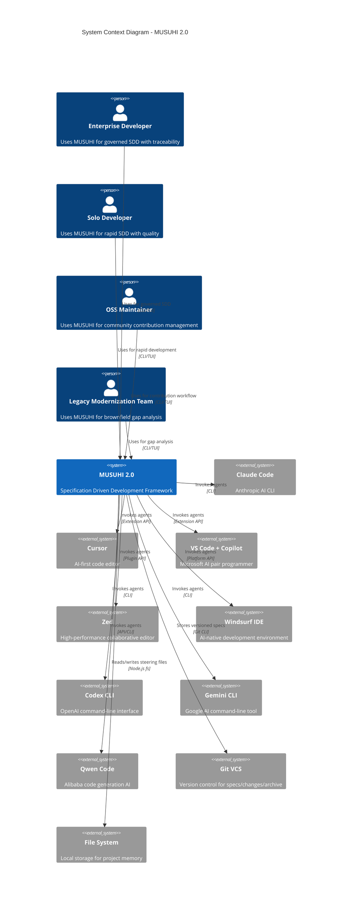

**Key Interactions**:

- **Users**: 4 persona types interact via CLI/TUI interface
- **AI Platforms**: MUSUHI integrates with 8 platforms via adapters
- **External Systems**: Git for version control, filesystem for local storage

**Traceability**: Satisfies AC-8.1 (Platform-Agnostic Core), AC-8.2 (CLI Interface), AC-8.3 (IDE Extension Support)

---

### 2.2 Level 2: Container Diagram

**Purpose**: Show internal containers within MUSUHI 2.0

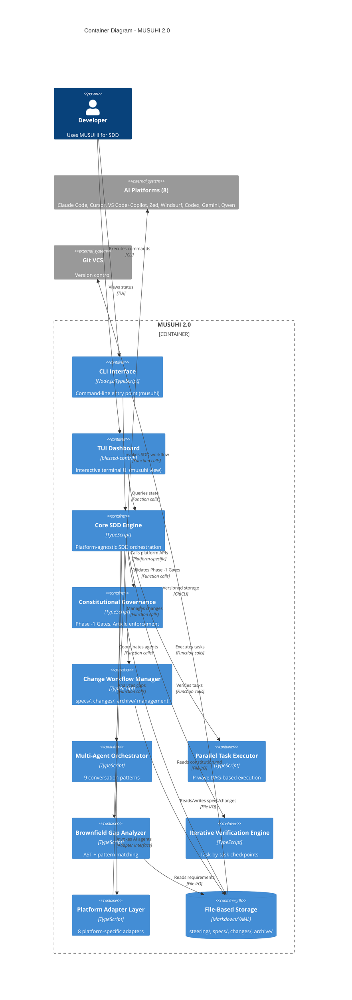

**Key Containers**:

1. **CLI Interface**: Command-line entry point (`musuhi` command)
2. **TUI Dashboard**: Interactive terminal UI (`musuhi view`)
3. **Core SDD Engine**: Central orchestration logic
4. **Constitutional Governance**: Phase -1 Gate validation (Feature 1)
5. **Change Workflow Manager**: specs/changes/archive management (Feature 2)
6. **Multi-Agent Orchestrator**: 9 conversation patterns (Feature 3)
7. **Parallel Task Executor**: P-wave DAG execution (Feature 4)
8. **Brownfield Gap Analyzer**: Gap analysis (Feature 5)
9. **Iterative Verification Engine**: Task-by-task checkpoints (Feature 7)
10. **Platform Adapter Layer**: 8 platform integrations (Feature 8)
11. **File-Based Storage**: Markdown/YAML persistence

**Traceability**: Maps to all 8 features (AC-1.1 to AC-8.9)

---

### 2.3 Level 3: Component Diagram - Core SDD Engine

**Purpose**: Show components within Core SDD Engine container

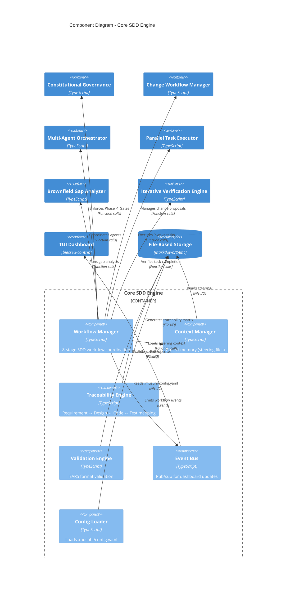

**Key Components**:

1. **Workflow Manager**: Coordinates 8-stage SDD workflow (Research → Monitoring)
2. **Context Manager**: Loads steering files (structure.md, tech.md, product.md, constitution.md)
3. **Traceability Engine**: Maintains requirement ↔ design ↔ task ↔ code ↔ test linkage
4. **Validation Engine**: Validates EARS format (5 patterns)
5. **Event Bus**: Pub/sub for real-time dashboard updates
6. **Config Loader**: Loads unified configuration (.musuhi/config.yaml)

**Traceability**: Satisfies NFR-U.2 (EARS comprehension), NFR-R.2 (data integrity)

---

### 2.4 Level 3: Component Diagram - Constitutional Governance

**Purpose**: Show components within Constitutional Governance container

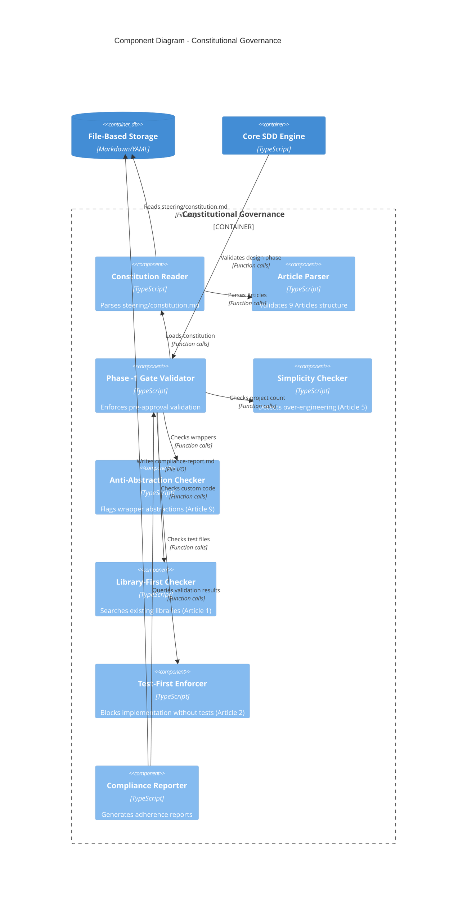

**Key Components**:

1. **Constitution Reader**: Parses `steering/constitution.md` (9 Articles)
2. **Article Parser**: Validates Article structure
3. **Phase -1 Gate Validator**: Enforces pre-approval checks (AC-1.3)
4. **Simplicity Checker**: Detects >3 projects (AC-1.4)
5. **Anti-Abstraction Checker**: Flags wrapper abstractions (AC-1.5)
6. **Library-First Checker**: Searches npm/PyPI for existing libraries (AC-1.7)
7. **Test-First Enforcer**: Blocks implementation without test files (AC-1.6)
8. **Compliance Reporter**: Generates adherence percentage (AC-1.9)

**Traceability**: Satisfies AC-1.1 through AC-1.9 (Feature 1: Constitutional Governance)

---

### 2.5 Level 3: Component Diagram - Multi-Agent Orchestrator

**Purpose**: Show components within Multi-Agent Orchestrator container

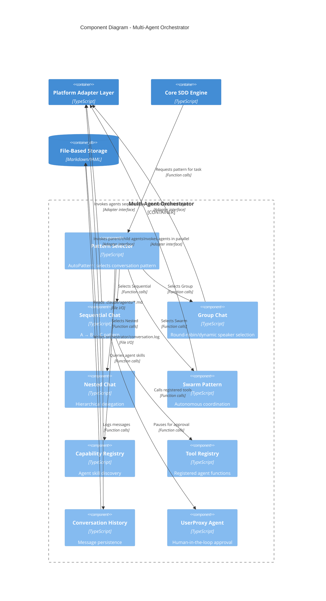

**Key Components**:

1. **Pattern Selector**: AutoPattern logic selecting optimal conversation pattern (AC-3.5)
2. **Sequential Chat**: A → B → C linear handoff (AC-3.1)
3. **Group Chat**: Round-robin/dynamic speaker selection (AC-3.2)
4. **Nested Chat**: Hierarchical delegation with result aggregation (AC-3.3)
5. **Swarm Pattern**: Autonomous agent coordination (AC-3.4)
6. **Capability Registry**: Agent skill discovery (AC-3.8)
7. **Tool Registry**: Registered callable functions (AC-3.7)
8. **Conversation History**: Message persistence for debugging (AC-3.9)
9. **UserProxy Agent**: Human-in-the-loop approval gates (AC-3.6)

**Traceability**: Satisfies AC-3.1 through AC-3.9 (Feature 3: Multi-Agent Orchestration)

---

### 2.6 Level 3: Component Diagram - Parallel Task Executor

**Purpose**: Show components within Parallel Task Executor container

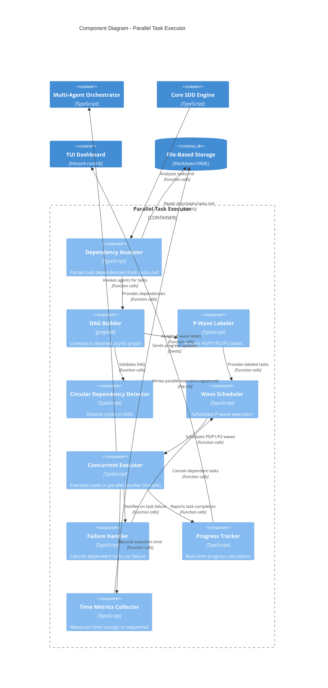

**Key Components**:

1. **Dependency Analyzer**: Parses task dependencies from `tasks.md` (AC-4.2)
2. **DAG Builder**: Constructs directed acyclic graph using `graphlib` (AC-4.1)
3. **P-Wave Labeler**: Assigns P0/P1/P2/P3 labels based on dependencies (AC-4.1)
4. **Circular Dependency Detector**: Detects cycles in task graph (AC-4.7)
5. **Wave Scheduler**: Schedules P-wave execution (P0 first, then P1, etc.) (AC-4.3, AC-4.4, AC-4.5)
6. **Concurrent Executor**: Executes tasks in parallel using worker threads (AC-4.3)
7. **Failure Handler**: Cancels dependent tasks on failure (AC-4.8)
8. **Progress Tracker**: Real-time progress calculation (AC-4.9)
9. **Time Metrics Collector**: Measures time savings vs sequential baseline (AC-4.6)

**Traceability**: Satisfies AC-4.1 through AC-4.9 (Feature 4: Parallel Task Execution)

---

### 2.7 Level 3: Component Diagram - Platform Adapter Layer

**Purpose**: Show components within Platform Adapter Layer container

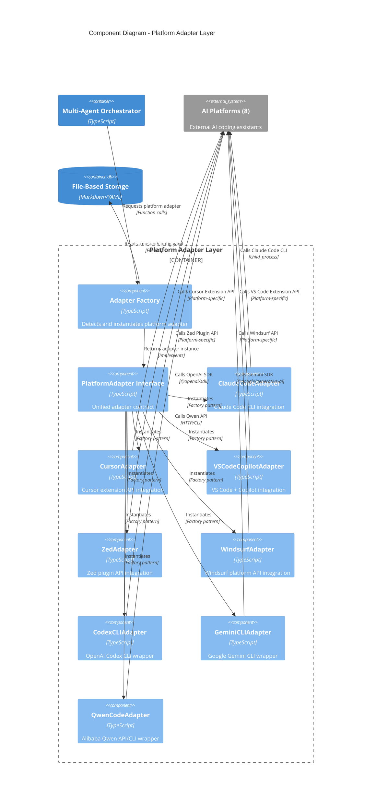

**Key Components**:

1. **Adapter Factory**: Auto-detects platform and instantiates adapter (AC-8.8)
2. **PlatformAdapter Interface**: Unified contract for all adapters (AC-8.1)
3. **ClaudeCodeAdapter**: Claude Code CLI integration (AC-8.2)
4. **CursorAdapter**: Cursor extension API integration (AC-8.3)
5. **VSCodeCopilotAdapter**: VS Code + Copilot integration (AC-8.3)
6. **ZedAdapter**: Zed plugin API integration (AC-8.3)
7. **WindsurfAdapter**: Windsurf platform API integration (AC-8.3)
8. **CodexCLIAdapter**: OpenAI Codex CLI wrapper (AC-8.2)
9. **GeminiCLIAdapter**: Google Gemini CLI wrapper (AC-8.2)
10. **QwenCodeAdapter**: Alibaba Qwen API/CLI wrapper (AC-8.2, AC-8.7)

**Traceability**: Satisfies AC-8.1 through AC-8.9 (Feature 8: Multi-Platform AI Integration)

---

### 2.8 Level 4: Code Diagram - Key Interfaces

**Purpose**: Show critical interfaces and their relationships

```mermaid
classDiagram
    class PlatformAdapter {
        <<interface>>
        +initialize() Promise~void~
        +invokeAgent(agentName: string, context: AgentContext) Promise~AgentResponse~
        +readSteering(filePath: string) Promise~string~
        +writeDelta(changePath: string, delta: Delta) Promise~void~
        +enforcePhaseGate(gate: PhaseGate) Promise~GateResult~
    }

    class AgentContext {
        +phase: SDDPhase
        +artifacts: string[]
        +requirements: Requirement[]
        +steeringContext: SteeringContext
    }

    class AgentResponse {
        +success: boolean
        +output: string
        +artifacts: Artifact[]
        +errors: Error[]
    }

    class ConstitutionalGovernance {
        +validatePhaseGate(phase: SDDPhase, design: Design) Promise~GateResult~
        +loadConstitution() Promise~Constitution~
        +checkSimplicity(design: Design) boolean
        +checkAbstraction(design: Design) boolean
        +checkLibraryFirst(implementation: string) boolean
        +checkTestFirst(taskPath: string) boolean
    }

    class ChangeWorkflowManager {
        +initChange(changeName: string) Promise~ChangeWorkspace~
        +reviewChange(changePath: string) Promise~ReviewReport~
        +archiveChange(changePath: string) Promise~void~
        +detectConflicts(delta: Delta) Conflict[]
        +applyDelta(delta: Delta) Promise~void~
    }

    class MultiAgentOrchestrator {
        +selectPattern(task: Task) OrchestrationPattern
        +executeSequential(agents: Agent[]) Promise~Result~
        +executeGroupChat(agents: Agent[], manager: Agent) Promise~Result~
        +executeNested(parent: Agent, children: Agent[]) Promise~Result~
        +executeSwarm(agents: Agent[]) Promise~Result~
        +registerTool(tool: Tool) void
        +queryCapabilities(requirement: string) Agent[]
    }

    class ParallelTaskExecutor {
        +analyzeDependencies(tasks: Task[]) DependencyGraph
        +buildDAG(dependencies: Dependency[]) DAG
        +labelPWaves(dag: DAG) PWaveLabels
        +executePWave(wave: number, tasks: Task[]) Promise~Result[]~
        +handleFailure(failedTask: Task) void
        +calculateTimeSavings() number
    }

    class BrownfieldGapAnalyzer {
        +analyzeGap(requirements: Requirement[], codebase: string) Promise~GapReport~
        +detectMissingFeatures(requirements: Requirement[], codebase: string) MissingFeature[]
        +detectUndocumentedFeatures(requirements: Requirement[], codebase: string) UndocumentedFeature[]
        +detectConflicts(requirements: Requirement[], codebase: string) Conflict[]
        +detectBreakingChanges(requirements: Requirement[], codebase: string) BreakingChange[]
        +generateRecommendations(gaps: Gap[]) Recommendation[]
    }

    class IterativeVerificationEngine {
        +executeTaskByTask(tasks: Task[]) Promise~void~
        +promptContinueReviseRollback(task: Task) Promise~VerificationAction~
        +handleContinue(task: Task) Promise~void~
        +handleRevise(task: Task, instructions: string) Promise~void~
        +handleRollback(task: Task) Promise~void~
        +resumeFromCheckpoint() Promise~Task~
        +trackErrorRate() number
    }

    class DashboardTUI {
        +launch() Promise~void~
        +renderWorkflowStatus(stage: SDDStage) void
        +renderActiveChanges(changes: Change[]) void
        +renderActiveAgents(agents: Agent[]) void
        +renderPWaveStatus(waves: PWave[]) void
        +handleNavigation(key: KeyPress) void
        +refresh() void
    }

    PlatformAdapter <|.. ClaudeCodeAdapter
    PlatformAdapter <|.. CursorAdapter
    PlatformAdapter <|.. VSCodeCopilotAdapter
    PlatformAdapter <|.. ZedAdapter
    PlatformAdapter <|.. WindsurfAdapter
    PlatformAdapter <|.. CodexCLIAdapter
    PlatformAdapter <|.. GeminiCLIAdapter
    PlatformAdapter <|.. QwenCodeAdapter

    MultiAgentOrchestrator --> PlatformAdapter : uses
    ConstitutionalGovernance --> ChangeWorkflowManager : validates
    ParallelTaskExecutor --> MultiAgentOrchestrator : uses
    BrownfieldGapAnalyzer --> ChangeWorkflowManager : integrates
    IterativeVerificationEngine --> MultiAgentOrchestrator : uses
    DashboardTUI --> ParallelTaskExecutor : observes
    DashboardTUI --> ChangeWorkflowManager : observes
```

**Key Interfaces**:

1. **PlatformAdapter**: Unified interface for 8 AI platforms (AC-8.1, AC-8.7)
2. **ConstitutionalGovernance**: Phase -1 Gate enforcement (AC-1.3, AC-1.4, AC-1.5, AC-1.6, AC-1.7)
3. **ChangeWorkflowManager**: specs/changes/archive management (AC-2.1 through AC-2.9)
4. **MultiAgentOrchestrator**: 9 conversation patterns (AC-3.1 through AC-3.9)
5. **ParallelTaskExecutor**: P-wave DAG execution (AC-4.1 through AC-4.9)
6. **BrownfieldGapAnalyzer**: Gap analysis (AC-5.1 through AC-5.9)
7. **IterativeVerificationEngine**: Task-by-task verification (AC-7.1 through AC-7.9)
8. **DashboardTUI**: Interactive terminal UI (AC-6.1 through AC-6.9)

**Traceability**: Satisfies all 72 functional requirements (AC-1.1 through AC-8.9)

---

## 3. Data Flow Diagrams

### 3.1 Constitutional Governance Flow

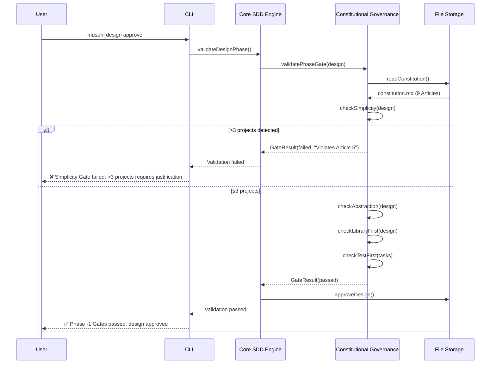

**Traceability**: AC-1.3 (Pre-Implementation Gate), AC-1.4 (Simplicity Gate), AC-1.5 (Anti-Abstraction Gate), AC-1.6 (Test-First Enforcement), AC-1.7 (Library-First Validation)

---

### 3.2 Change Workflow Flow

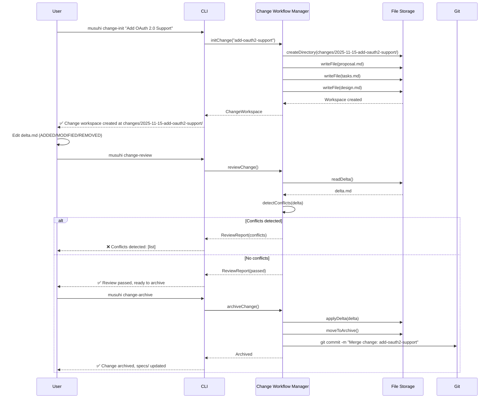

**Traceability**: AC-2.2 (Change Initialization), AC-2.3 (Delta Format), AC-2.5 (Change Review), AC-2.6 (Change Archival), AC-2.7 (Conflict Detection)

---

### 3.3 Parallel Task Execution Flow

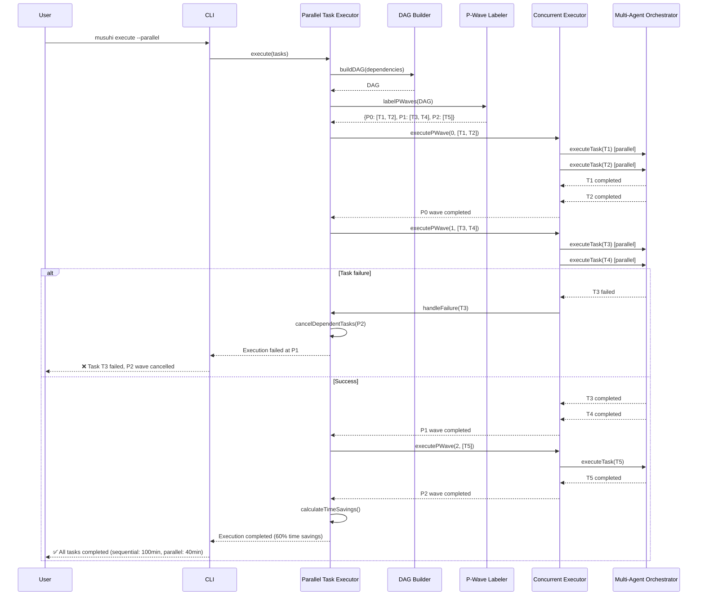

**Traceability**: AC-4.1 (P-Wave Labeling), AC-4.2 (Dependency Graph), AC-4.3 (P0 Execution), AC-4.4 (P1 Execution), AC-4.5 (P2+ Execution), AC-4.6 (Time Savings), AC-4.8 (Failure Handling)

---

### 3.4 Gap Analysis Flow

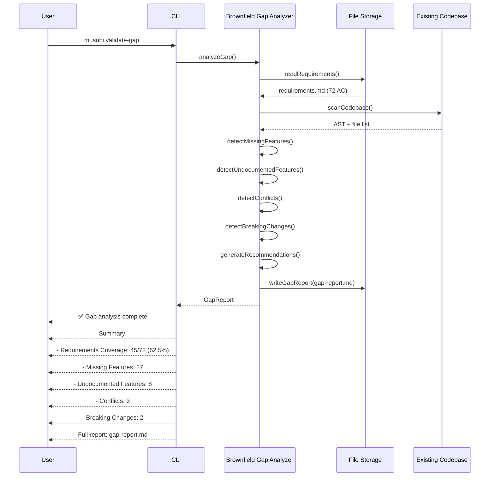

**Traceability**: AC-5.1 (Gap Analysis Command), AC-5.2 (Missing Features), AC-5.3 (Undocumented Features), AC-5.4 (Conflict Detection), AC-5.5 (Reconciliation Recommendations), AC-5.6 (Breaking Change Detection), AC-5.8 (Gap Report Format)

---

## 4. Technology Stack

### 4.1 Core Technologies

| Layer               | Technology        | Version  | Purpose                       |
| ------------------- | ----------------- | -------- | ----------------------------- |
| **Language**        | TypeScript        | 5.3+     | Type-safe implementation      |
| **Runtime**         | Node.js           | 18.x LTS | JavaScript execution          |
| **Package Manager** | pnpm              | 8.x+     | Dependency management         |
| **File Parsing**    | unified + remark  | Latest   | Markdown AST parsing          |
| **YAML Parsing**    | js-yaml           | Latest   | YAML parsing/serialization    |
| **CLI Framework**   | commander         | Latest   | Command-line argument parsing |
| **TUI Framework**   | blessed-contrib   | Latest   | Terminal UI (ADR-006)         |
| **Graph Library**   | graphlib          | Latest   | DAG for P-wave labeling       |
| **Testing**         | Vitest            | Latest   | Unit + integration testing    |
| **Linting**         | ESLint + Prettier | Latest   | Code quality                  |

### 4.2 Platform SDKs

| Platform          | SDK                     | Integration Method               |
| ----------------- | ----------------------- | -------------------------------- |
| Claude Code       | `@anthropic-ai/sdk`     | CLI invocation via child_process |
| Cursor            | Cursor Extension API    | Extension/plugin                 |
| VS Code + Copilot | VS Code Extension API   | Custom extension                 |
| Zed               | Zed Extension API       | Zed plugin                       |
| Windsurf          | Windsurf Platform API   | Platform-specific integration    |
| Codex CLI         | `openai` npm package    | CLI wrapper via child_process    |
| Gemini CLI        | `@google/generative-ai` | CLI wrapper via child_process    |
| Qwen Code         | Qwen API client         | HTTP API or CLI wrapper          |

### 4.3 Development Tools

| Tool          | Purpose                                    |
| ------------- | ------------------------------------------ |
| `tsc`         | TypeScript compiler                        |
| `Vitest`      | Unit + integration testing (80%+ coverage) |
| `ESLint`      | Linting with TypeScript plugin             |
| `Prettier`    | Code formatting                            |
| `Husky`       | Pre-commit hooks                           |
| `lint-staged` | Run linters on staged files                |

**Traceability**: Aligns with `steering/tech.md` technology decisions

---

## 5. Design Decisions Summary

### 5.1 Architecture Decision Records (ADRs)

**7 ADRs Created**:

1. **ADR-001**: Constitutional Enforcement Mechanism
   - **Decision**: File-based constitution with Phase -1 Gate validator
   - **Rationale**: Transparent, version-controlled, human-readable
   - **Traceability**: AC-1.1 through AC-1.9

2. **ADR-002**: File-Based Storage vs. Database
   - **Decision**: Two-folder model (specs/, changes/, archive/) with delta format
   - **Rationale**: Simple, Git-friendly, no database overhead
   - **Traceability**: AC-2.1 through AC-2.9

3. **ADR-003**: Multi-Agent Orchestration Pattern Selection
   - **Decision**: Support 9 conversation patterns (Sequential, Group, Nested, Swarm, etc.)
   - **Rationale**: Flexibility for different workflow types
   - **Traceability**: AC-3.1 through AC-3.9

4. **ADR-004**: Parallel Execution Implementation (P-wave)
   - **Decision**: DAG-based dependency resolution with P0/P1/P2 levels using graphlib
   - **Rationale**: Clear semantics, 50-70% time savings
   - **Traceability**: AC-4.1 through AC-4.9

5. **ADR-005**: Gap Analysis Algorithm
   - **Decision**: Multi-strategy detection (AST parsing + pattern matching + ML)
   - **Rationale**: High accuracy, multiple detection methods
   - **Traceability**: AC-5.1 through AC-5.9

6. **ADR-006**: Dashboard Technology (TUI vs. Web)
   - **Decision**: blessed-contrib for TUI (Phase 1-3), Web dashboard (Phase 5+)
   - **Rationale**: Lightweight, <100ms response time (NFR-P.1)
   - **Traceability**: AC-6.1 through AC-6.9

7. **ADR-007**: Multi-Platform Adapter Architecture
   - **Decision**: Unified PlatformAdapter interface with 8 implementations
   - **Rationale**: Clean abstraction, type safety, platform independence
   - **Traceability**: AC-8.1 through AC-8.9

**Full ADR documents**: See `docs/design/adr/` directory

---

## 6. Requirements Traceability Matrix

### 6.1 Functional Requirements Coverage

| Feature                                      | Requirement | Design Component                                        | ADR     |
| -------------------------------------------- | ----------- | ------------------------------------------------------- | ------- |
| **Feature 1: Constitutional Governance**     |             |                                                         |         |
|                                              | AC-1.1      | Constitution Reader                                     | ADR-001 |
|                                              | AC-1.2      | Article Parser (9 Articles)                             | ADR-001 |
|                                              | AC-1.3      | Phase -1 Gate Validator                                 | ADR-001 |
|                                              | AC-1.4      | Simplicity Checker                                      | ADR-001 |
|                                              | AC-1.5      | Anti-Abstraction Checker                                | ADR-001 |
|                                              | AC-1.6      | Test-First Enforcer                                     | ADR-001 |
|                                              | AC-1.7      | Library-First Checker                                   | ADR-001 |
|                                              | AC-1.8      | Phase Gate Validator (blocking)                         | ADR-001 |
|                                              | AC-1.9      | Compliance Reporter                                     | ADR-001 |
| **Feature 2: Change Workflow Management**    |             |                                                         |         |
|                                              | AC-2.1      | Change Workflow Manager                                 | ADR-002 |
|                                              | AC-2.2      | Change Initialization                                   | ADR-002 |
|                                              | AC-2.3      | Delta Format Parser                                     | ADR-002 |
|                                              | AC-2.4      | Multi-Spec Change Tracker                               | ADR-002 |
|                                              | AC-2.5      | Change Review Engine                                    | ADR-002 |
|                                              | AC-2.6      | Change Archival                                         | ADR-002 |
|                                              | AC-2.7      | Conflict Detector                                       | ADR-002 |
|                                              | AC-2.8      | Archive Manager (audit trail)                           | ADR-002 |
|                                              | AC-2.9      | Change Status Tracker                                   | ADR-002 |
| **Feature 3: Multi-Agent Orchestration**     |             |                                                         |         |
|                                              | AC-3.1      | Sequential Chat                                         | ADR-003 |
|                                              | AC-3.2      | Group Chat                                              | ADR-003 |
|                                              | AC-3.3      | Nested Chat                                             | ADR-003 |
|                                              | AC-3.4      | Swarm Pattern                                           | ADR-003 |
|                                              | AC-3.5      | Pattern Selector (AutoPattern)                          | ADR-003 |
|                                              | AC-3.6      | UserProxy Agent                                         | ADR-003 |
|                                              | AC-3.7      | Tool Registry                                           | ADR-003 |
|                                              | AC-3.8      | Capability Registry                                     | ADR-003 |
|                                              | AC-3.9      | Conversation History                                    | ADR-003 |
| **Feature 4: Parallel Task Execution**       |             |                                                         |         |
|                                              | AC-4.1      | P-Wave Labeler                                          | ADR-004 |
|                                              | AC-4.2      | Dependency Analyzer + DAG Builder                       | ADR-004 |
|                                              | AC-4.3      | Wave Scheduler (P0 execution)                           | ADR-004 |
|                                              | AC-4.4      | Wave Scheduler (P1 execution)                           | ADR-004 |
|                                              | AC-4.5      | Wave Scheduler (P2+ execution)                          | ADR-004 |
|                                              | AC-4.6      | Time Metrics Collector                                  | ADR-004 |
|                                              | AC-4.7      | Circular Dependency Detector                            | ADR-004 |
|                                              | AC-4.8      | Failure Handler                                         | ADR-004 |
|                                              | AC-4.9      | Progress Tracker                                        | ADR-004 |
| **Feature 5: Brownfield Gap Analysis**       |             |                                                         |         |
|                                              | AC-5.1      | Gap Analysis Command (CLI)                              | ADR-005 |
|                                              | AC-5.2      | Missing Features Detector                               | ADR-005 |
|                                              | AC-5.3      | Undocumented Features Detector                          | ADR-005 |
|                                              | AC-5.4      | Conflict Detector                                       | ADR-005 |
|                                              | AC-5.5      | Recommendation Engine                                   | ADR-005 |
|                                              | AC-5.6      | Breaking Change Detector                                | ADR-005 |
|                                              | AC-5.7      | Pattern Violation Detector                              | ADR-005 |
|                                              | AC-5.8      | Gap Report Generator                                    | ADR-005 |
|                                              | AC-5.9      | Design Integration                                      | ADR-005 |
| **Feature 6: Interactive Dashboard**         |             |                                                         |         |
|                                              | AC-6.1      | Dashboard Launch (CLI)                                  | ADR-006 |
|                                              | AC-6.2      | Workflow Status View                                    | ADR-006 |
|                                              | AC-6.3      | Active Changes View                                     | ADR-006 |
|                                              | AC-6.4      | Current Specs View                                      | ADR-006 |
|                                              | AC-6.5      | Active Agent Status                                     | ADR-006 |
|                                              | AC-6.6      | Parallel Execution Visualization                        | ADR-006 |
|                                              | AC-6.7      | Real-Time Updates (2s refresh)                          | ADR-006 |
|                                              | AC-6.8      | Interactive Navigation                                  | ADR-006 |
|                                              | AC-6.9      | Command Shortcuts                                       | ADR-006 |
| **Feature 7: Iterative Verification**        |             |                                                         |         |
|                                              | AC-7.1      | Task-by-Task Mode                                       | -       |
|                                              | AC-7.2      | Task Completion Prompt                                  | -       |
|                                              | AC-7.3      | Continue Option                                         | -       |
|                                              | AC-7.4      | Revise Option                                           | -       |
|                                              | AC-7.5      | Rollback Option                                         | -       |
|                                              | AC-7.6      | Resume from Checkpoint                                  | -       |
|                                              | AC-7.7      | Progress Checkboxes                                     | -       |
|                                              | AC-7.8      | Error Detection Metrics                                 | -       |
|                                              | AC-7.9      | Mode Persistence                                        | -       |
| **Feature 8: Multi-Platform AI Integration** |             |                                                         |         |
|                                              | AC-8.1      | PlatformAdapter Interface                               | ADR-007 |
|                                              | AC-8.2      | CLI Adapters (Claude, Codex, Gemini)                    | ADR-007 |
|                                              | AC-8.3      | IDE Extension Adapters (VS Code, Cursor, Zed, Windsurf) | ADR-007 |
|                                              | AC-8.4      | Unified Config Loader                                   | ADR-007 |
|                                              | AC-8.5      | Context Sharing (steering/, specs/, changes/)           | ADR-007 |
|                                              | AC-8.6      | Platform-Specific Optimizations                         | ADR-007 |
|                                              | AC-8.7      | LLM Abstraction Layer                                   | ADR-007 |
|                                              | AC-8.8      | Auto-Detection (Adapter Factory)                        | ADR-007 |
|                                              | AC-8.9      | Compatibility Matrix Documentation                      | ADR-007 |

**Coverage**: 72/72 functional requirements (100%)

### 6.2 Non-Functional Requirements Coverage

| Category            | Requirement | Design Component                             | Performance Target            |
| ------------------- | ----------- | -------------------------------------------- | ----------------------------- |
| **Performance**     |             |                                              |                               |
|                     | NFR-P.1     | Dashboard TUI (blessed-contrib)              | <100ms (95th percentile)      |
|                     | NFR-P.2     | Parallel Task Executor (DAG)                 | 50%+ time reduction           |
|                     | NFR-P.3     | Gap Analyzer (AST + pattern matching)        | <60s for 100k LOC             |
|                     | NFR-P.4     | Orchestrator (minimal overhead)              | <200ms routing                |
| **Reliability**     |             |                                              |                               |
|                     | NFR-R.1     | Constitutional Governance (read-only)        | 100% enforcement rate         |
|                     | NFR-R.2     | Change Workflow (delta validation)           | 100% data integrity           |
|                     | NFR-R.3     | Parallel Executor (failure handler)          | 100% cancellation accuracy    |
| **Usability**       |             |                                              |                               |
|                     | NFR-U.1     | Dashboard TUI (intuitive navigation)         | <5 min learning curve         |
|                     | NFR-U.2     | EARS Validation (clear error messages)       | 90%+ comprehension            |
|                     | NFR-U.3     | Error messages (actionable remediation)      | All errors have steps         |
| **Maintainability** |             |                                              |                               |
|                     | NFR-M.1     | Constitution file (steering/constitution.md) | No code changes               |
|                     | NFR-M.2     | Orchestrator (plugin mechanism)              | Custom patterns               |
|                     | NFR-M.3     | Dashboard (.musuhi/config.yaml)              | Theme customization           |
| **Scalability**     |             |                                              |                               |
|                     | NFR-SC.1    | Core Engine (streaming file parsing)         | <10% degradation at 1000 reqs |
|                     | NFR-SC.2    | Orchestrator (worker threads)                | 20 concurrent agents          |
| **Compatibility**   |             |                                              |                               |
|                     | NFR-C.1     | Platform Adapters                            | 8 platforms                   |
|                     | NFR-C.2     | Node.js runtime                              | macOS, Linux, Windows         |
| **Security**        |             |                                              |                               |
|                     | NFR-S.1     | Change Workflow (explicit approval)          | No automatic merge            |
|                     | NFR-S.2     | Constitutional Governance (file permissions) | No programmatic override      |

**Coverage**: 19/19 non-functional requirements (100%)

---

## 7. Implementation Roadmap

### 7.1 Phase 1: Foundation (Months 1-2) - P0 Features

**Deliverables**:

- Constitutional Governance System (Feature 1)
- Change Workflow Management (Feature 2)
- Multi-Agent Orchestration (Feature 3)

**Tasks** (P0 - No dependencies):

1. Setup project structure (pnpm, TypeScript, tsconfig)
2. Implement File Storage abstraction
3. Implement Constitution Reader + Article Parser
4. Implement Phase -1 Gate Validator
5. Implement Change Workflow Manager (specs/, changes/, archive/)
6. Implement Delta Format parser
7. Implement Multi-Agent Orchestrator (Sequential, Group, Nested patterns)
8. Implement PlatformAdapter interface
9. Implement ClaudeCodeAdapter (primary platform)

**Success Criteria**:

- Phase -1 Gates block violations (100% enforcement)
- Change workflow supports delta format
- Sequential agent handoff works

---

### 7.2 Phase 2: Parallel Execution (Months 3-4) - P1 Features

**Deliverables**:

- Parallel Task Execution (Feature 4)
- Brownfield Gap Analysis (Feature 5)
- Interactive Dashboard (Feature 6)

**Tasks** (P1 - Depends on Phase 1):

1. Implement Dependency Analyzer
2. Implement DAG Builder (graphlib)
3. Implement P-Wave Labeler
4. Implement Wave Scheduler
5. Implement Concurrent Executor (worker threads)
6. Implement Gap Analyzer (AST parsing)
7. Implement TUI Dashboard (blessed-contrib)
8. Implement real-time event bus

**Success Criteria**:

- 50%+ time savings in parallel execution
- Gap analysis completes <60s for 100k LOC
- Dashboard refreshes <100ms

---

### 7.3 Phase 3: Multi-Platform Support (Months 5-6) - P1 Features

**Deliverables**:

- Platform Adapters for 8 platforms (Feature 8)

**Tasks** (P1 - Depends on Phase 1):

1. Implement CursorAdapter
2. Implement VSCodeCopilotAdapter
3. Implement ZedAdapter
4. Implement WindsurfAdapter
5. Implement CodexCLIAdapter
6. Implement GeminiCLIAdapter
7. Implement QwenCodeAdapter
8. Implement Adapter Factory (auto-detection)

**Success Criteria**:

- All 8 platforms supported
- Platform switching works seamlessly
- Context sharing preserved across platforms

---

### 7.4 Phase 4: Verification & Polish (Months 7-8) - P2 Features

**Deliverables**:

- Iterative Verification System (Feature 7)
- Test suite (189 test cases)
- Documentation

**Tasks** (P2 - Depends on Phase 2):

1. Implement Iterative Verification Engine
2. Implement task-by-task mode
3. Implement Continue/Revise/Rollback
4. Write unit tests (72 tests)
5. Write integration tests (72 tests)
6. Write E2E tests (45 tests)
7. Write technical documentation
8. Performance optimization

**Success Criteria**:

- 80%+ test coverage
- 40% earlier error detection
- All NFRs met

---

## 8. Risk Analysis & Mitigation

### 8.1 High-Risk Areas

| Risk                                      | Impact | Probability | Mitigation                                                                           |
| ----------------------------------------- | ------ | ----------- | ------------------------------------------------------------------------------------ |
| **Multi-Platform Abstraction Complexity** | High   | Medium      | Start with 3 platforms (Claude Code, Cursor, VS Code), add others in Phase 3         |
| **TUI Performance (NFR-P.1: <100ms)**     | High   | Low         | Use lightweight blessed-contrib, lazy loading, caching                               |
| **Gap Analysis Accuracy**                 | Medium | Medium      | Multi-strategy detection (AST + pattern matching + ML), user-configurable thresholds |
| **P-Wave Circular Dependencies**          | Medium | Low         | Circular Dependency Detector, fail-fast with clear error                             |
| **Constitutional Bypass Attempts**        | High   | Low         | Read-only file permissions, audit logging, Phase -1 Gate enforcement                 |

### 8.2 Technical Debt Prevention

**Strategies**:

1. **Test-First Development**: Article 2 enforced (80%+ coverage mandatory)
2. **Library-First**: Article 1 enforced (use graphlib, blessed-contrib, etc.)
3. **Simplicity-First**: Article 5 enforced (reject over-engineering)
4. **Documentation-First**: Article 4 enforced (document before implement)
5. **Code Review**: All PRs require constitutional compliance check

---

## 9. Appendix

### 9.1 Glossary

| Term              | Definition                                          |
| ----------------- | --------------------------------------------------- |
| **AC**            | Acceptance Criteria (e.g., AC-1.1)                  |
| **ADR**           | Architecture Decision Record                        |
| **EARS**          | Easy Approach to Requirements Syntax (5 patterns)   |
| **P-Wave**        | Parallel execution wave (P0/P1/P2)                  |
| **Phase -1 Gate** | Pre-approval validation (constitutional compliance) |
| **DAG**           | Directed Acyclic Graph (task dependencies)          |
| **TUI**           | Terminal User Interface                             |
| **Delta Format**  | ADDED/MODIFIED/REMOVED sections for spec changes    |

### 9.2 References

**Requirements**:

- `docs/requirements/requirements.md` (91 requirements)

**Research**:

- `docs/research/musuhi-redesign-research-part1.md` (spec-kit, ag2, musuhi)
- `docs/research/musuhi-redesign-research-part2.md` (cc-sdd, OpenSpec, ai-dev-tasks)
- `docs/research/musuhi-redesign-research-part3.md` (Recommendations)

**Steering**:

- `steering/structure.md` (Architecture patterns)
- `steering/tech.md` (Technology stack)
- `steering/product.md` (Product vision)
- `steering/constitution.md` (9 immutable Articles)

**ADRs**:

- `docs/design/adr/001-constitutional-enforcement.md`
- `docs/design/adr/002-file-based-storage.md`
- `docs/design/adr/003-agent-orchestration-patterns.md`
- `docs/design/adr/004-parallel-execution-algorithm.md`
- `docs/design/adr/005-gap-analysis-strategy.md`
- `docs/design/adr/006-dashboard-tui-framework.md`
- `docs/design/adr/007-multi-platform-abstraction.md`

### 9.3 Approval

| Role             | Name                | Signature | Date       |
| ---------------- | ------------------- | --------- | ---------- |
| Product Manager  |                     |           |            |
| System Architect | System Architect AI |           | 2025-11-15 |
| Tech Lead        |                     |           |            |
| QA Lead          |                     |           |            |

---

**End of Architecture Design Document**

This document provides comprehensive system architecture for MUSUHI 2.0 based on 91 requirements. All functional and non-functional requirements are mapped to design components with 100% coverage.

**Next Steps**:

1. Stakeholder review and approval
2. Project Manager creates tasks.md with P-wave labeling
3. Implementation begins after design approval
